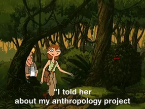

```{=html}
<style>
  /* 1. Ensanchar el espacio horizontal de las diapositivas */
  .reveal .slides {
    width: 95% !important;  /* Usa el 95% del ancho de la pantalla */
    max-width: 1500px !important; /* Límite máximo para que no se deforme */
  }

  /* 2. Disminuir el tamaño de la letra del texto normal (viñetas, párrafos) */
  .reveal {
    font-size: 28px !important; /* Achica este número si lo quieres aún más pequeño */
  }

  /* 3. Disminuir el tamaño de los títulos de cada diapositiva */
  .reveal h2 {
    font-size: 45px !important; 
  }
</style>
```

---
title: "Métodos Cuantitativos I"
author: "Gino Ocampo & Sebastián Muñoz Tapia"
format: 
  revealjs:
    theme: default
    slide-number: true
editor: visual
---

## Tabla de contenidos

1.  Presentación\
2.  Acuerdos básicos y programación\
3.  Introducción a investigación cuantitativa\
4.  Propuestas de Investigación

# 01. Presentación {background-color="#4B0082"}

## Persona y ¿Qué se sabe de la ISCUAN?

El curso como una etnografía sobre el “mundo cuantitativo”:

-   ¿Cuáles son mis prejuicios y preconceptos sobre lo cuantitativo?

{fig-align="center" width="100%"}

## Persona y ¿Qué se sabe de la ISCUAN?

-   ¿Cómo puedo superarlos, tratar de conocer y participar de ese mundo?

-   ¿Cómo me sitúo en ese mundo? (Auto-etnografía)

{fig-align="center" width="100%"}

## Conteste lo siguiente

-   Ingrese a [Menti.com](https://www.menti.com)\
-   Código: **2328 7528**

*(Acá puedes insertar la imagen del QR de Mentimeter)* ``

# 02. Acuerdos básicos y programación {background-color="#4B0082"}

## Elementos de horario de entrada y participación \[No negociable\]

-   Se requiere un 70% de actividades lectivas. En total son 26 clases considerando separadamente los dos bloques (martes 13:00 a 14:20 y viernes 14:30 a 15:50).

-   Para aprobar deberá asistir al menos a **18 bloques**, aceptando un máximo de **8 inasistencias** (4 días completos).

-   Se tomará asistencia en ambos bloques, 15 minutos luego de comenzar las clases. **Posterior a eso no se reconocerá la asistencia.**

-   Personas con 9 o 10 inasistencias podrán a optar a una prueba recuperativa si tienen un promedio mayor a 5,5 en sus evaluaciones individuales. La prueba será individual e incluye todos los contenidos del curso. Si su nota es superior a 4.0 podrán aprobar el curso en términos de asistencia.

-   Desde 11 inasistencias injustificadas se reprueba inmediatamente el curso.\

-   Inasistencia a evaluaciones y entrega de trabajos se justifica con certificado médico en Coordinación Académica.

-   Otras situaciones (laborales, de cuidados)se presentan con la debida anticipación a la Coordinación Académica.

## Ayudantía y Tutorías {.smaller}

-   **Asistencia en ayudantía:** De 7 ayudantías, se espera participación en al menos 3 para aprobar.

-   **Tutorías:** Se podrán solicitar tutorías con el profesor o los ayudantes los grupos que se hayan inscrito en torno a un tema específico a trabajar durante el curso. Por su parte, para ser atendidos en tutoría, cada grupo debe enviar por correo electrónico los puntos que desea tratar con 48 horas de anticipación. De no contarse con un listado específico de temas – incluso a nivel de aproximación - a tratar, no se atenderá en tutoría.

Disponibilidad de tutorías

Gino: Viernes 16:00 a 19:00 (U. Alberto Hurtado) **Tutorías obligatorias trabajo final (16/06/2026)**

## Uso de IA {.smaller}

-   La carrera de Antropología de la Universidad Alberto Hurtado entiende el uso de la inteligencia artificial —ChatGPT, Bing, Gemini u otros— como una posible herramienta auxiliar en los procesos de aprendizaje, que en ningún caso puede reemplazar las labores y experiencias de investigación, análisis, reflexión y/o escritura por parte de los/as estudiantes.
-   Si bien su uso podría ser un recurso útil en la formación profesional contemporánea, los y las docentes **se reservan el derecho a verificar que los productos académicos de los/as estudiantes que hagan uso de inteligencia artificial se correspondan con aprendizajes sustantivos.**
-   Para ello, podrán verificar el dominio de los contenidos, reflexiones y léxicos utilizados en las entregas por parte de los estudiantes, a través de medios orales y/o escritos complementarios y/o adicionales aplicados de manera presencial, toda vez que lo estimen conveniente.

# ¿Qué hacer con las clases/evaluaciones si hay movilizaciones, paros, tomas, etcétera?

## Propuesta

-   Después de dos semanas, se imparte clase online, considerando asistencia. Evaluaciones: reprogramar primera evaluación; si se acumula más de una hacerla considerando la realización de clases.\
    Recuperativas: ajustar un horario común. Si no coincide con otra materia, se cuenta asistencia.

## Foco del curso {.smaller}

-   **Producto Final:** Encuesta de Estudiantes de Antropología, deberán realizar un pre-test al resto de lxs compañerxs de este curso, para en **Métodos II** hacerlo a una muestra de toda la carrera.

-   Introducción a **R Studio** (Comenzamos desde la tercera clase).\
    {fig-align="center" width="100%"}

## Organización del curso

-   **Enfoque práctico y aplicado:** Las clases de metodología están diseñadas para que avancen en su propia investigación y aprendan a procesar su cuestionario a medida que ven la teoría.
-   **Introducción gradual a R:** Empezarán a usar el programa desde la tercera clase para asegurar que tengan el tiempo suficiente para familiarizarse con él.
-   **Compromiso con la asistencia:** Es crucial llegar a la hora y no faltar, ya que los contenidos son correlativos (se construyen uno sobre otro) y requieren atención continua para comprender el razonamiento cuantitativo.

## Temas de curso pasado

-   Hábitos de lectura
-   Vida Saludable
-   Alcohol en estudiantes
-   Ética en la investigación
-   Usos de RRSS
-   Conciencia y práctica ambientales
-   Tiempo de ocio y tiempo libre
-   Prácticas religiosas

## Evaluaciones del Curso {.smaller}

| Actividad Evaluativa | Breve Descripción | Modalidad | Fecha | Ponderación |
|----------|-------------------------------|----------|----------|----------|
| Prueba 1 (oral) | Habrá un banco general de aproximadamente 40 preguntas (20 sobre metodología y 20 sobre R). A cada estudiante se le sorteará aleatoriamente una pregunta de cada área para que la responda. eoría/Metodología: Introducción a la investigación cuantitativa, diseño de investigación y el lugar de la teoría. Práctica/R Studio: Introducción general, tipos de objetos, proyectos, paquetes, funciones y manejo de bases de datos. | Individual | 14-04-2026 | 20% |
| Avance 1: Diseño y cuestionario |Incorpora: problema de investigación, breve marco teórico, diseño de investigación, operacionalización de las variables y el cuestionario. Se incorporan, además, fichas bibliográficas (una por cada integrante de grupo). |Grupal | 19-05-2026 | 15% |  
| Prueba Individual 2 (escrita) |(a) materia prueba 1; (b) operacionalización, técnicas de producción de datos, el cuestionario, trabajo de campo; (c) tidyverse  |Individual | 02-06-2026 | 25% |  
| Examen: Trabajo final (70% escrito/ 30% pres.) | Consolida los documentos de avance, incluye: problema de investigación, breve marco teórico y diseño metodológico incluido el análisis de datos que sirve como testeo de instrumento (cuestionario) por parte de estudiantes del curso. Se exponen resultados. | Grupal 119\] | 23-06-2026 | 30% |  
| Participación en talleres, clases y tareas| Aula invertida | Individual | \- | 10% |  

# 03. Introducción ISCUAN {background-color="#4B0082"}

## ¿Qué es la investigación social?

Según Hernández-Sampieri & Mendoza Torres (2019):

> "Conjunto de procesos sistemáticos, críticos y empíricos que se aplican al estudio de un fenómeno o problema con el resultado (o el objetivo) de ampliar su conocimiento" 135\]

-   **Metodología:** “Encadenamiento de decisiones controladas y razonadas”\
-   **Diseño metodológico:** “Forma de explicar y defender ese proceso”

## ¿Qué es la investigación social cuantitiva?

-   **Números:** Se vincula a conteos numéricos y métodos matemáticos (Niglas, 2010).\
-   **Secuencial:** Proceso organizado de manera secuencial para comprobar suposiciones.
-   **"Objetividad":** Búsqueda, pretensión.\
-   **Generalización:** Que los resultados puedan aplicarse a la población general.

*(Aquí puedes insertar la imagen de las Fases del proceso cuantitativo)* ``

## Investigación Cuantitativa: ¿Estrategia o Paradigma?

**a. Una estrategia (Asun, 2019)**\
Utiliza procedimientos estadísticos para resumir, manipular y asociar números asignados a magnitudes de sujetos de estudio.

**b. Un paradigma (Cea, 1998)**\
Defiende un único método general a todas las ciencias, con énfasis en la explicación, la contrastación empírica y la medición objetiva.

## El camino mixto

-   Entrelazamiento cuantitativo y cualitativo, interacción y potenciación.\
-   Mezcla de datos: numéricos, verbales, textuales, visuales simbólicos, descripciones.\
-   Importancia fundamental de la **TRIANGULACIÓN**.

## ¿Qué es big data y ciencias de datos?

-   Proliferación de datos por digitalización: redes sociales, celulares, escuchas de Spotify, etc.\
-   Las **3 V**: volumen, velocidad y variedad.\
-   Usualmente datos no estructurados.

*(Acá puedes insertar la imagen de Black Mirror)* ``\
\# 04. Propuestas de Investigación {background-color="#4B0082"}

## Temas de interés

-   Ingrese a [Menti.com](https://www.menti.com)\
-   Código: **8456 2780**

*(Acá puedes insertar la imagen del segundo QR de Mentimeter)* ``

## Tarea I

Grupos de 6 personas: conversen sobre algunas ideas en común para investigar que tengan encuestas asociadas. Deben ser posibles de realizar por jóvenes universitarios.

-   Defina los grupos.
-   Traiga **2 ideas de investigación** por grupo.
