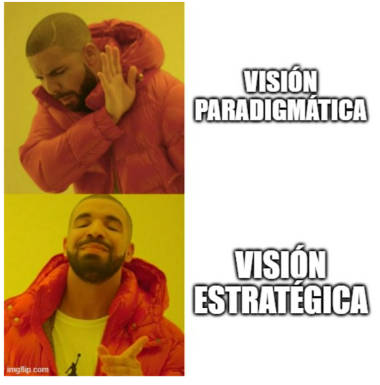
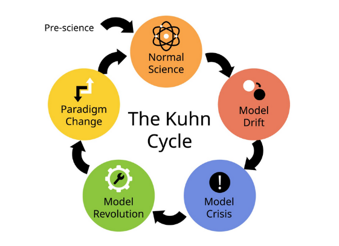
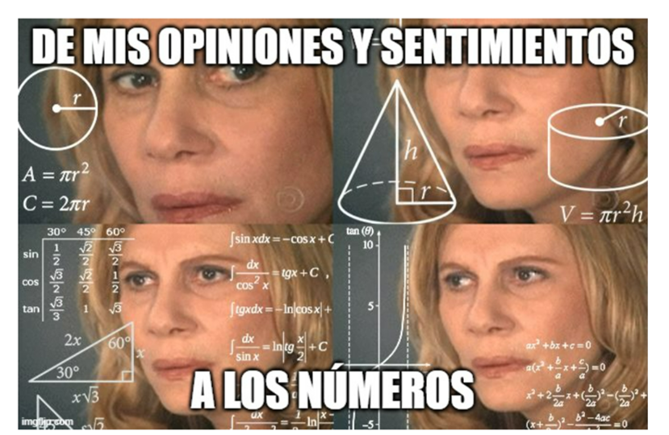
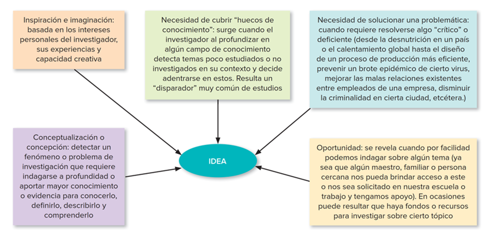
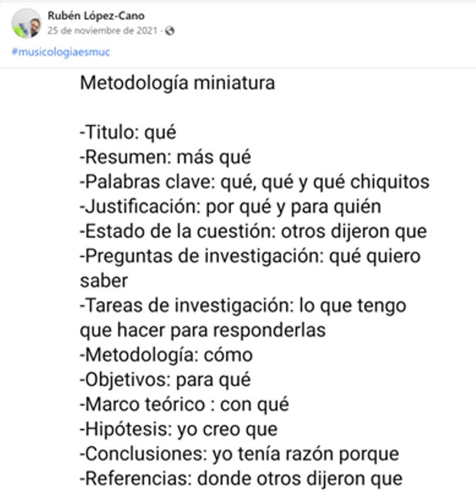
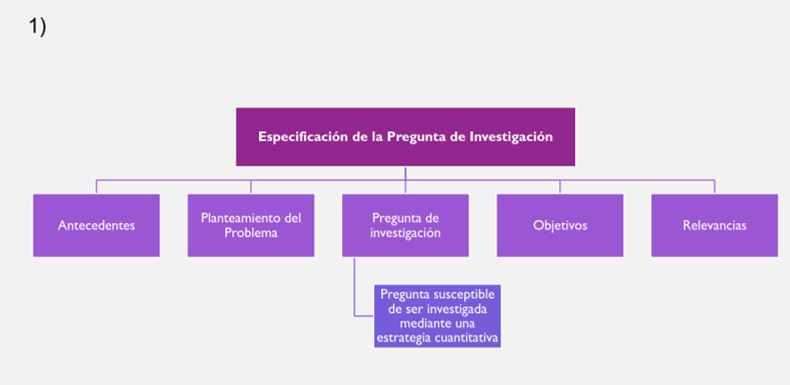
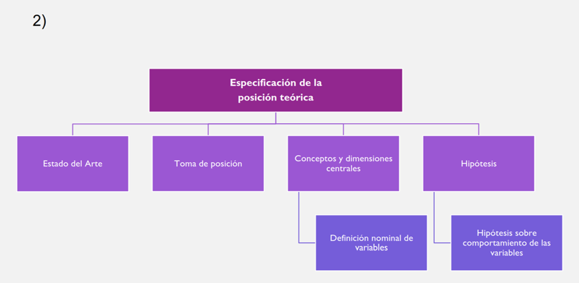
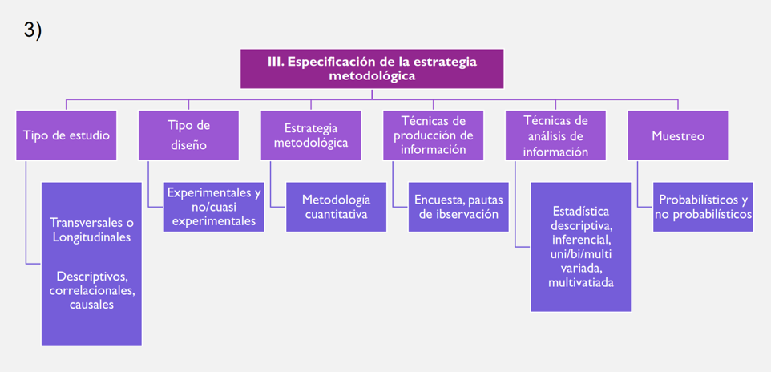

```{=html}
<style>
  /* 1. Ensanchar el espacio horizontal de las diapositivas */
  .reveal .slides {
    width: 95% !important;  /* Usa el 95% del ancho de la pantalla */
    max-width: 1500px !important; /* Límite máximo para que no se deforme */
  }

  /* 2. Disminuir el tamaño de la letra del texto normal (viñetas, párrafos) */
  .reveal {
    font-size: 28px !important; /* Achica este número si lo quieres aún más pequeño */
  }

  /* 3. Disminuir el tamaño de los títulos de cada diapositiva */
  .reveal h2 {
    font-size: 45px !important;
  }
</style>
```

---
title: "Métodos Cuantitativos I"
author: "Gino Ocampo & Sebastián Muñoz Tapia"
format: 
  revealjs:
    theme: default
    slide-number: true
editor: visual
---

## Tabla de contenidos

1.  Síntesis sesión anterior\
2.  Numeración y medición\
3.  Las ideas de investigación\
4.  El diseño

# 01. Síntesis sesión anterior {background-color="#4B0082"}

# ¿Qué vimos la clase pasada?

{fig-align="center"}

# ¿Qué vimos la clase pasada?

{fig-align="center" width="50%"}

# ¿Qué vimos la clase pasada?

{fig-align="center" width="100%"}

## Preconceptos y Prejuicios de lo cuantitativo

- Rodrigo Asún:\ 

“Visiones exageradas/peligrosa ingenuidad sobre lo cuantitativo”:

> a) carácter **"objetivo y válido"**: poco críticos con sus productos, asumiéndolos como verdades neutras e independientes de ellos mismos y de sus juicios y prejuicios; 
 
> b)  carácter **“positivista y parcial”** de esta estrategia tienden a abandonar hasta la posibilidad de su utilización, mutilando sus capacidades de exploración de la realidad social

- **Actitud informada: potencialidades y límites**

## Paradigma vs Estrategia

- Definición paradigmática (modelo integral): mochila pesada 

    -Técnicas de análisis y producción de información 
    
    -Perspectiva epistemológica: positivismo, funcionalismo, búsqueda de objetividad, relación causal, generalización, sujetos atomizados; ideología (dominante capitalista)
    
- Definición estratégica (técnica y operativa): mochila liviana

Actualmente prima la visión **estratégica** por sobre la **paradigmática**

# ¿Por qué un investigador cuantitativo debe ser positivista?

# ¿Por qué un investigador cuantitativo debe creer que sus resultados son “objetivos"?

# ¿Por qué un investigador cuantitativo debe suponer que sus sujetos de estudio son entidades atomizadas?

## Ojo

Si, parece existir cierta correlación empírica entre métodos cualitativos o cuantitativos y adscribir a cierta percepción de la realidad social y del conocimiento científico

Hay más investigadores cuantitativos: positivistas y experimentalistas

## ¿Por qué un investigador cuantitativo debe ser positivista^[La ciencia progresa de forma lineal y acumulativa (siempre sumando conocimiento).Existe una observación neutral de los hechos (el científico es un espejo objetivo de la realidad).]?

La verdad es que yo no creo adscribir a ese modelo epistemológico (las críticas de la escuela kuhniana^[No es lineal: Para Kuhn, la ciencia avanza a saltos y, a veces, al cambiar de paradigma, perdemos conocimientos que antes considerábamos útiles (esto se llama "pérdida de Kuhn"). No hay neutralidad: Kuhn sostiene que lo que un científico ve depende de su paradigma. No vemos el mundo "tal cual es", sino a través de los lentes de nuestra teoría] me parecen en gran parte acertadas), y me niego firmemente a dejar de utilizar la estadística.

---
## Thomas Khun

{fig-align="left"}
{fig-align="right"}

## ¿Por qué un investigador cuantitativo debe creer que sus resultados son “objetivos”?

> Personalmente, cuando he aplicado algún instrumento para medir emociones no creo estar midiendo “hechos objetivos”, ni menos aún creo que mi forma de redactar las preguntas no influya en los resultados obtenidos; por el contrario, mi experiencia me indica que el solo hecho de preguntar modifica la realidad del sujeto (a veces incluso creando una opinión que no existe, proceso que tiene nombre: **“cristalización”**), y con mayor razón influyen el lenguaje y la redacción específica de la pregunta.

## ¿Por qué un investigador cuantitativo debe suponer que sus sujetos de estudio son entidades atomizadas?

> Eso no solo sería ingenuidad, sino profunda ignorancia de los procesos de socialización que son responsables de que la gente asigne valores positivos o negativos a determinadas conductas.


{fig-align="center"}
{fig-align="center"}
# 02. Numerización y medición de la realidad social {background-color="#4B0082"}

## Objetivos de la sesión

- Discutir sobre implicancias del proceso de “medición” en Ciencias Sociales
- Introducir al diseño de investigación cuantitativa

## ¿Qué implicancias tiene la utilización de números?

Teoría de la medición → formas de tratar a las variables (*ver el mundo en variables*)

Técnica de codificación → instrumentos de recolección de información


## ¿Qué implicancias tiene la utilización de números?

- Procedimiento de traducción → **operacionalización**

- Procedimiento de selección de sujetos → **muestreo**

- Procedimiento de análisis de información → **estadística**

- Procedimiento de validación → **jueces, técnicas estadísticas**


## ¿Qué es medir? ¿Por qué lo hacemos?

Medir es asignar números a propiedades de los sujetos que definimos analíticamente
Sentido de usar números: 

    - Simplicidad: ideas claras y unívocas
    
    - Orden: unidimensional de menor a mayor a menor
    
    - Distancia: tienen orden de distancia. 
    
[PP: ¿Qué es medir para la ISCUAN y qué sentido tiene usar números?] {style="color: #4B0082;"}

{fig-align="center"}


- Medir es asignar números a propiedades de los sujetos que  definimos analíticamente → estrategia analítica 

¿Qué propiedades?

Se asignan números a propiedades de los sujetos que son definidas  analíticamente mediante un **proceso de abstracción**.

## Consecuencias de **reducción cuantitativa**

- Propiedades/Variables tienen que  ser simples y distinguibles, para permitir que se aísle una parte de la complejidad mediante un número. E.g. Posición entorno a la legalización de la marihuana o el aborto.

- Datos obtenidos, también deben ser lo más simples posibles (Si/No)

- Supuesto: nada esencial se pierde en el proceso aunque simplifiquemos la realidad 

    - estadística permitiría reconstruir la complejidad  perdida

- Sin embargo, inevitablemente se pierde la perspectiva global de los sujetos

- En este contexto, la operación **teórica** se vuelve clave, en tanto medimos **constructos**.

[PP: **¿por qué se habla de que medir de forma cuantitativa es una “reducción?**"]{style="color: #4B0082;"}

## La estrategia analítica 

La estrategia analítica tiene su raíz en el tipo de análisis estadístico que es posible realizar para nuestras variables, y que usa como base la ‘matriz de datos’ *aka* la *Base de datos*

{fig-align="center"}

La matriz permite relacionar muchas propiedades de los mismos objetos/sujetos al mismo tiempo, y aplicar técnicas estadísticas al  estudio de los hechos sociales.

## Teorías de la medición

>**Medición ordinaria**: Contar propiedades discretas: cuantos objetos hay del tipo contado - CANTIDAD

>**Medición fundamental**: Teoría clásica de la Medición (Campbell)

- MAGNITUD

Medir es asignar números en función del número de **veces que cabe** una **unidad de medida** en el objeto que se quiere medir (la regla)

Implica:

  -**Arbitrariedad** en la selección de unidad de medida
  
  -**Baja aplicabilidad** en ciencias sociales 

#

Medición ordinaria: cantidades para variables [**discretas**]{style="color: #4B0082;"}

Medición fundamental: magnitudes para variables [**continuas**]{style="color: #4B0082;"}

{fig-align="center"}


## ¿Qué teoría de la medición hay detrás?

{fig-align="center"}

## Teoría representacional de la medición (Stanley Stevens, 1946)

Medir es **una representación arbitraria** de relaciones entre propiedades. 

Mediante una regla que tiene significados específicos según lo que se esté observando. El 1 y el 2 puede ser hombre/mujer o apruebo/rechazo.

Se opera por  ‘reglas de asignación’ y se establecen diferentes ‘niveles de medida’: 

- Nominal ([**distinción**]{style="color: #4B0082;"})
- Ordinal ([**orden**]{style="color: #4B0082;"})

- Numéricas([**Magnitud**]{style="color: #4B0082;"}):

    - Intervalar (**distancia**) - el 0 es relativo a la escala
    - Razón (**cero absoluto** - ausencia de la cualidad medida)

[PP: Defina lo que es una variable nominal, ordinal, intervalar y de razón y de un ejemplo para cada una de ellas]{style="color: #4B0082;"}

## Implicancias de la teoría representacional de la medición

- No hay ‘unidades de medida’ (kilogramo, metro, etc.)
- Los números son asignados de manera arbitraria mediante ‘reglas’.
- Lo clave es más la ‘relación’ entre números que los números en sí (lo importante es que los números representen ‘relaciones’ entre objetos)
- La interpretación de los números es más ambigua. 

[PP: ¿Qué implicancias tiene la teoría representacional de la medición?]{style="color: #4B0082;"}

## Medición indirecta o medición por índices

En ciencias sociales la medición tiende a ser indirecta

• ¿La razón?: medimos **constructos latentes** más que manifiestos (e.g. nivel de autoritarismo vs. altura o peso)

• ¿Cómo lo hacemos?: a través de indicadores indirectos → a esto le llamamos ‘**medición indirecta o medición por índices**’

• ¿Qué procedimiento seguimos? → la medición indirecta se desarrolla mediante el ‘proceso de **operacionalización**’

# 03. Las ideas de investigación {background-color="#4B0082"}

## Ideas de investigación

{fig-align="center" width="100%"} 


Ideas con potencial para iniciar investigación
 
- Intrigar, alentar y motivar al investigador (propio)

A veces son a pedido por campo educacional, académico o laboral (del mundo social donde uno se mueve)

De lo vago/confuso a lo específico que es investigable

- Conocer antecedentes o estudios previos 
(Hernández-Sampieri & Mendoza Torres, 2019)


# 04. El diseño de investigación {background-color="#4B0082"}

## Diseño y su formulación cuantitativa

- Distinción entre **diseño** y **proyecto**

- El ‘proyecto de investigación’ (es un concepto más global; refiere al diseño, los recursos y el tiempo)

- El ‘diseño de la investigación’ (estrategia concreta para conseguir los objetivos de la investigación, parte clave del proyecto)


## 4.1 Objetivo(s) del proyecto de investigación

- Representar a otro una idea de investigación de manera clara
- Construir un relato coherente (el relato es siempre más lineal que la práctica)
- Demostrar que el proyecto es factible

** Recordar la idea de hacer explícito

## Etapas del diseño de investigación

I. Especificación de la **pregunta de investigación**: *¿Qué se quiere conocer específicamente?* (delimitar)

    - Introducción
    - Planteamiento del problema y pregunta de investigación
    - Objetivos de la investigación
    - Relevancias

## Etapas del diseño de investigación

II. Especificación de la posición **teórica**: *¿Con qué materiales teóricos e investigaciones previas?*
 - Estado del arte (Marco teórico y/O revisión bibliográfica)
 - Toma de posición (fundamentada)
 - Definición de conceptos centrales y/o definición nominal de variables
 - Hipótesis
 
## Etapas del diseño de investigación

III. Especificación de la **metodología**:  *¿Cómo se quiere investigar?*

- Tipo de investigación
- Tipo de diseño
- Diseño de la muestra 
- Técnicas de producción de información 
- Técnicas de análisis de información (*Plan de análisis*)

## Etapas del diseño de investigación

{fig-align="center"} 
  
{fig-align="center"}  
{fig-align="center"}  

{fig-align="center"}  
## El problema y la pregunta

{fig-align="left"}  
{fig-align="right"}  
## Terror in Resonance                                               

- Terror en Tokio (*Zankyou no Terror* o *Terror in Resonance*) es una serie de anime que gira en torno a dos jóvenes, llamados Nine y Twelve, quienes se presentan como los terroristas responsables de una serie de ataques en Tokio. 

- **Shibasaki** es un detective retirado que juega un papel crucial en la serie. A pesar de haberse distanciado del cuerpo policial, se ve arrastrado nuevamente a la investigación de los atentados de "Sphinx". Su intelecto y experiencia lo posicionan como el único capaz de descifrar los mensajes y acertijos dejados por los terroristas (hacerse buenas preguntas).

- A lo largo de la trama, Shibasaki no solo sigue el rastro de Nine y Twelve, sino que también empatiza con sus motivos, lo que lo convierte en una figura clave para descubrir la verdad detrás de la conspiración gubernamental. Su papel es esencial como el puente entre la ley y la verdad oculta, ya que, aunque es un representante de la justicia, también es crítico del sistema corrupto que los protagonistas buscan exponer.

## [PP: ¿Qué constituye una buena pregunta de investigación?]{style="color: #4B0082;"}

1.  No debe ser ni demasiado amplia (imposible) ni demasiado específica (irrelevante)

2. Deben estar claramente definidos:

- El objeto de estudio
- Los conceptos y/o variables
- Los sujetos
- El tiempo
- El espacio

3. Debe tener alguna conexión con la **teoría** y la **investigación existente**

4. Debe ser capaz de hacer alguna contribución original (**relevante** en ámbitos académicos)

## Ejemplos de preguntas de investigación que no pueden ser estudiadas empíricamente:

*¿Cuáles son las causas verdaderas que explican el quiebre de la democracia en Chile en 1973?*

- Imposibles de responder

*¿Qué variables socioculturales se asocian al proceso de despolitización de los chilenos?*

- Muy generales

*¿Cuál es la relación entre nivel educacional y consumo cultural en el Chile moderno?*

- Sin sujeto de estudio definido

*¿En qué se diferencia el modo de vivir de católicos y evangélicos?*

- Sin objeto de estudio definido

*¿Cuál es la opinión de los narcotraficantes chilenos frente a la nueva ley de consumo de drogas?*

- Con problemas de acceso


