```{=html}
<style>
  /* 1. Ensanchar el espacio horizontal de las diapositivas */
  .reveal .slides {
    width: 95% !important;  /* Usa el 95% del ancho de la pantalla */
    max-width: 1500px !important; /* Límite máximo para que no se deforme */
  }

  /* 2. Disminuir el tamaño de la letra del texto normal (viñetas, párrafos) */
  .reveal {
    font-size: 28px !important; /* Achica este número si lo quieres aún más pequeño */
  }

  /* 3. Disminuir el tamaño de los títulos de cada diapositiva */
  .reveal h2 {
    font-size: 45px !important;
  }
</style>
```

---
title: "Métodos Cuantitativos I"
author: "Gino Ocampo & Sebastián Muñoz Tapia"
format: 
  revealjs:
    theme: default
    slide-number: true
editor: visual
---

## Tabla de contenidos

1.  Síntesis sesión anterior\
2.  Formulación del problema y pregunta, objetivos y relevancias\
3.  Especificación de la posición teórica\
4.  Ejercicios

# 01. Síntesis sesión anterior {background-color="#4B0082"}

# {fig-align="center"}

# De la Idea a la Pregunta

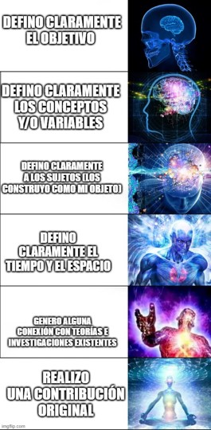{fig-align="center"}

## ¿Qué hemos visto?

-   

    1.  ¿Qué diferencia la **investigación en ciencias sociales** y el *conocimiento ordinario*?

-   

    2.  ¿Cuál es la diferencia entre la interpretación *paradigmática* y *estratégica* a la hora de analizar la investigación cuantitativa?

-   

    3.  ¿Cuáles son las diferencias generales ente la *investigación cualitativa*, *la cuantitativa* y *mixta*?

-   

    4.  ¿De donde vienen nuestras *ideas de investigación* y cómo desarrollarlas?

-   

    5.  ¿Qué implicancias tiene **medir** en Ciencias sociales?

    -   A pesar de la posibilidad de asumir una visión estratégica, medir tiene implicancias: existe un proceso de reducir la realidad a números.

------------------------------------------------------------------------

## ¿Qué hemos visto?

-   

    6.  ¿Cuáles son las distintas *teorías de la medición* y porqué en Ciencias Sociales se utiliza mayormente la **Teoría Representacional**?

-   

    7.  ¿Cuáles son los “**niveles de medida**” y cómo se caracterizan?

-   

    8.  ¿Por qué en Investigación Cuantitativa usualmente se mide de forma indirecta?\

-   

    9.  ¿Qué son las **ideas de investigación** y cómo pasar de ellas a *problemas investigables*?

-   

    10. ¿Qué es el *diseño de investigación* y cuál es su diferencia con el *proyecto de investigación*?

-   

    11. ¿Cuáles son las *etapas del diseño de investigación*?

-   

    12. ¿Qué es la *pregunta de investigación* y qué características debe tener para ser una buena pregunta?

# 

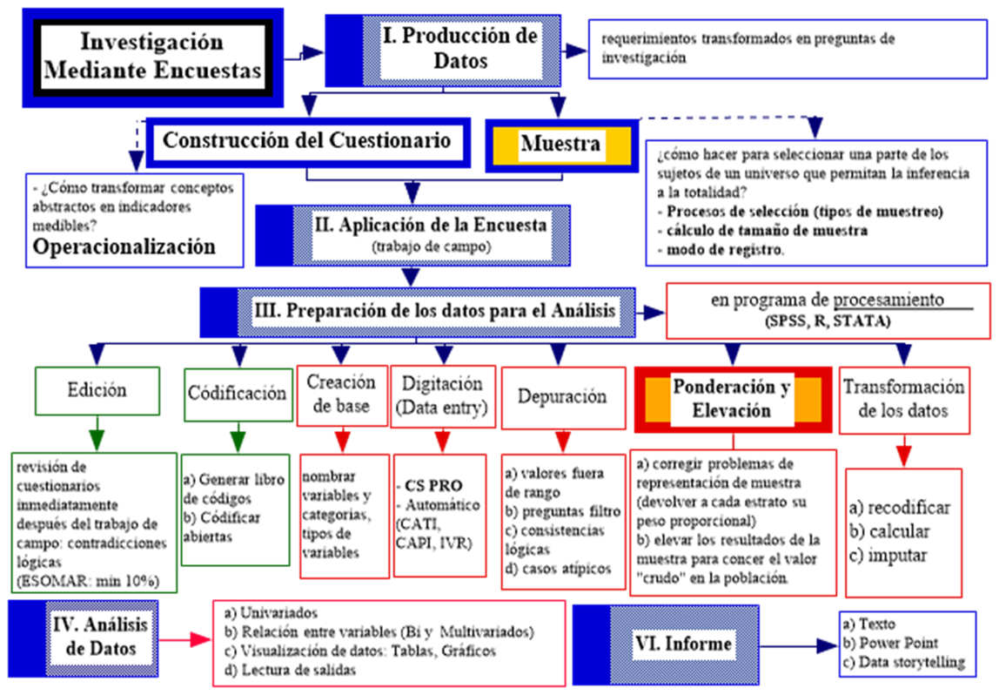{fig-align="center"} \# 02. Formulación del problema y pregunta, objetivos y relevancias {background-color="#4B0082"}

{fig-align="center"}

## 2.1 La pregunta en el problema

1.  Enunciar el problema:

    -   1.1 Describir *hechos* e *investigaciones* en relación con problema (¿Qué está pasando?) mostrar que es **factible observar/medir:** e.g. existen cambios en los modos de vincularse con la política, lectura, música en los/as jóvenes; que se han tratado de las siguientes maneras (x, y, z) y se ven influidos por (e,f,h)

    -   1.2 Dar cuenta de la *relevancia* de los hechos y *vinculo con otras variables*: e.g. estos hechos permiten adentrarnos en: formas de subjetividad, hacer colectivos, relacionarse con los objetos culturales… entre los/as jóvenes de XX, en XX. Lo que sería importante para entender/explorar por XX.

2.  Formular el problema (Pregunta de Investigación)

3.  Redacción **Clara**

# 

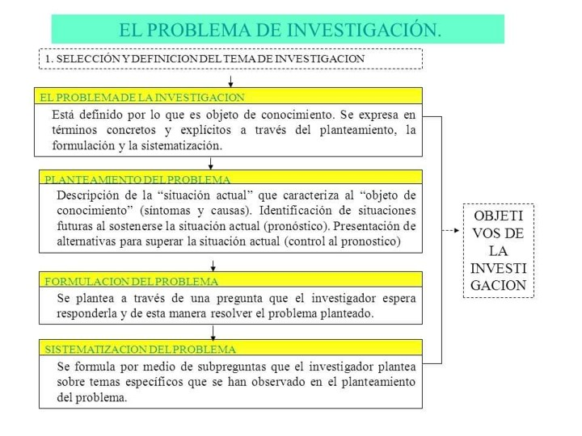{fig-align="center"}

## Cuatro pasos para problematizar (Cyril Lemieux)

#### 1. La creencia compartida (Sentido Común):

identificar qué es lo que la mayoría de la gente da por sentado (la naturalización de un fenómeno):

> El objetivo: Capturar la explicación que hace que el fenómeno parezca "obvio" o "normal". Mecanismo: Suele ser una explicación psicologizante (depende del carácter de la persona) o naturalista (es instinto, es biología).

-   *e.g.* *“el suicidio es individual”*.

#### 2. Inferencias lógicas (¿Qué debería pasar si eso es cierto?):

Si la creencia del paso 1 es una verdad absoluta, entonces el mundo debería comportarse de cierta manera medible.

> El objetivo: Crear una predicción basada en la creencia compartida. Mecanismo: Un razonamiento tipo "Si A es cierto, entonces deberíamos observar B".

-   *e.g.* Se puede esperar que… *“la tasa de suicidios varie y no tenga regularidad”*

------------------------------------------------------------------------

## Cuatro pasos para problematizar (Cyril Lemieux)

#### 3. Mostrar Hechos que Contradicen (La "Ruptura"):

Mostrar hechos que los contradicen (2) \[realidad observada es contradictoria a 2\]: Aquí presentas datos, estadísticas u observaciones empíricas que demuestran que lo que se predice en el paso 2 no ocurre en la realidad.

> El objetivo: Desnaturalizar el fenómeno. Hacer que lo que parecía "normal" ahora se vea como algo "extraño" o "anormal". Mecanismo: Contrastar la inferencia lógica con la realidad observada. (Aparece carácter parcial/erróneo de razonamientos, hacerlos antinaturales/ a-normales: lo que se juzga natural)

-   *e.g.* Pero… *“la tasa de suicidios es regular”*

#### 4. La pregunta de investigación:

Si el paso 1 dice ser verdad, pero el paso 3 demuestra lo contrario, tenemos una paradoja. El paso 4 es la **pregunta** que surge de esa tensión.

4.1 **La Tensión**: Se pregunta formalmente: ¿Cómo es posible que, si creemos que el fenómeno es individual (Paso 1), observemos regularidades sociales tan fuertes (Paso 3)?

4.2 **Buscar respuesta social(Lo social explica lo social)**: no busques la respuesta en la psicología del individuo. Debes buscar las causas en la estructura social, en las instituciones, en las normas o en la economía.

> Simetría: Tratar por igual los éxitos y los fracasos de la creencia inicial para entender por qué persiste.

4.3 **Reconstrucción vía plan analítico**: No se trata de decir que la creencia inicial era "mentira", sino que era parcial. El nuevo enfoque (tu investigación) permitirá integrar esa contradicción.

# 

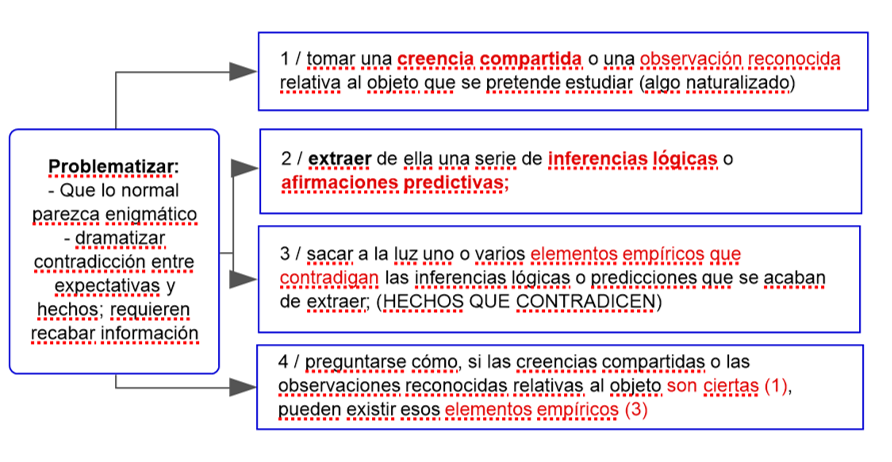{fig-align="center"}

## Ejemplo: Encuesta Nacional de Participación Cultural (MINCAP)

Problematización: - Desigualdades sociales afectan al consumo (visión tradicional) - Esto haría pensar que las clases populares, minorías o subalternos no consumen cultura. - Sin embargo, si hay “cultura” en las clases populares: desde las rancheras, la música urbana. - ¿Cómo entender otras manifestaciones culturales?

**Propuesta**: pasar del estudio del consumo cultural a la participación cultural; del **DERECHO a la CULTURA**; a LOS DERECHOS CULTURALES.

# 

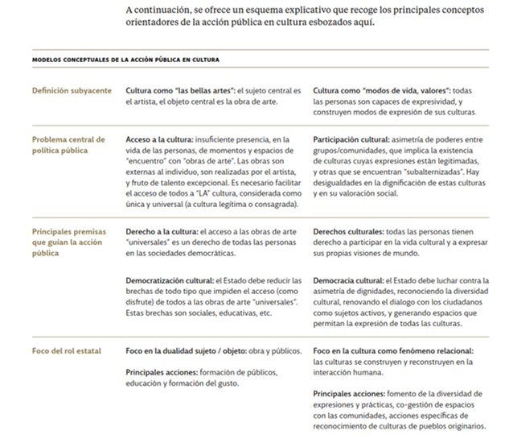{fig-align="center"}

## Problema y Preguntas

La Encuesta Nacional de Participación Cultural 2017 se propone (1) identificar y visualizar [cómo los chilenos vivencian, evalúan y configuran sus prácticas culturales actuales]{style="color: #4B0082;"} (2) en un contexto con altos niveles de desigualdad y exclusión social, pero con una ampliación acelerada del consumo-participación cultural gracias a las políticas de acceso así como también por las nuevas tecnologías de la información.

En síntesis, esta Encuesta Nacional de Participación Cultural busca dar respuesta a preguntas tales como: ¿qué nuevos perfiles de consumidores culturales han surgido en el Chile actual? ¿Cuáles son sus características, prácticas e identificaciones culturales? ¿Qué nuevas formas de equidad y/o desigualdad cultural han emergido en los últimos años a partir de la expansión tecnológica? ¿Qué datos nos permiten pensar e imaginar procesos de inclusión social y cultural en base a una democracia cultural contemporánea?

## 2.2 La unidad de análisis

La **unidad de análisis** es a quién (o qué) queremos estudiar; a quién (o qué) queremos examinar para establecer una descripción o una explicación con respecto a fenómenos que le suceden.

Pueden ser:

-   **Individuos** (los estudiantes, las madres solteras, los maestros, los trabajadores, etc.)
-   **Grupos** (familias, parejas, pandillas, ciudades, regiones, países, etc.)
-   **Organizaciones** (congregaciones religiosas, universidades, ramas del ejército, ministerios, etc.)
-   **Objetos Sociales**, ya sea:
    -   **Objetos concretos** (libros, diarios, canciones, edificios, editoriales de diarios , etc.)
    -   **Relaciones sociales** (los matrimonios, los divorcios, las manifestaciones estudiantiles, las revoluciones, etc.)
-   Las *unidades de análisis* no siempre coinciden con la ‘unidad de observación’ (pues no siempre podemos observarlas directamente):
    -   Características del hogar informado por uno de sus miembros
    -   ¿Se le ocurre alguna unidad de observación que informa de alguna unidad de análisis?

------------------------------------------------------------------------

-   Un estudio puede tener más de una unidad de análisis. etc.

    -   **CASEN**:

-   **Hogares**: Se consideran miembros de un hogar a todas aquellas personas que, siendo residentes de una misma vivienda, pueden tener o no vínculos de parentesco entre sí y habitualmente hacen vida en común, es decir, se alojan y se alimentan juntas. Dicho de otra forma, habitan en la misma vivienda y tienen presupuesto de alimentación común.

-   **Núcleo familiar**: Un núcleo familiar es una parte de un hogar (es decir, un subconjunto de sus miembros) y puede estar constituido por una persona sola o un grupo de personas. Comúnmente corresponden a parejas o adultos/as junto a una o más personas que dependen de ellos/as. Puede ocurrir que en un hogar exista uno o más núcleos familiares.

-   **Personas**

## ¿Cuáles son los principales problemas de los/as colegios pensados desde directores/profesores y estudiantes?

-   ¿Cuál es la ‘unidad de análisis’?
-   ¿Cuál(s) es(son) la(s) ‘unidad(es) de observación?

## 2.3 Objetivos

-   ¿Qué son los objetivos?

-   Operaciones de conocimiento necesarias para responder a la pregunta de investigación (no son operaciones técnicas)

-   Es el ¿PARA QUÉ? De la investigación

## 2.3 Objetivos

-   Son una desagregación de la pregunta de investigación, desde lo más general a lo más especifico
-   Todos los objetivos deben estar referidos a la pregunta (evitar el problema de la inclusión) Dos tipos de objetivos:
    -   Objetivos generales refieren a grandes operaciones analíticas
    -   Objetivos específicos refieren a operaciones más específicas (no pueden exceder al general, lo DESAGREGAN).
    -   Se vinculan a tareas de investigación específicas. Utilizar verbos en infinitivo como: determinar, conocer, describir, caracterizar…

# 

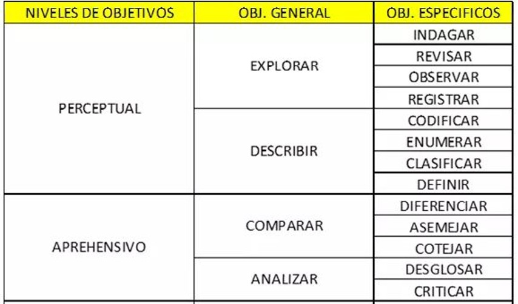{fig-align="center"}

# 

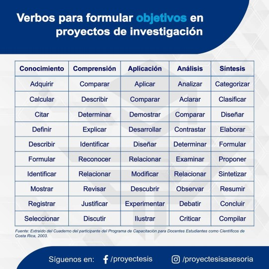{fig-align="center"}

## Ejemplo 1

-   Objetivo General:
    -   Conocer la relación que existe entre **‘satisfacción con la vida’** y **‘clase social subjetiva’** de los/as chilenos, según **‘nivel socioeconómico’**.
-   Objetivos Específicos:
    -   Determinar el **“nivel de satisfacción con la vida”** que presentan los/as chilenos/as.
    -   Caracterizar la **“clase social subjetiva”** de los/as chilenos/as.
    -   Establecer la influencia del **“nivel socioeconómico”** en la **“satisfacción con la vida”** de los/as chilenos/as
    -   Analizar la influencia del **“nivel socioeconómico”** en la **“clase social subjetiva”** de los/as chilenos/as
    -   Determinar la influencia del **“nivel socioeconómico”** en la relación que existe entre **“satisfacción con la vida”** y la **“clase social subjetiva”** de los/as chilenos.

## 2.4 Relevancias

¿Por qué es importante hacer está investigación? (más allá de mis intereses) Mi caso, es un caso de qué….?

Tres tipos de relevancias:

- Relevancia teórica (aporte en términos de conocimiento teórico) 
- Relevancia práctica (aporte en términos de intervención social) 
- Relevancia metodológica (aporte al instrumental técnico de la disciplina)

Ejemplos: 

- Entregar soporte empírico a la teoría X sobre violencia… 
-Contribuir a la formulación de políticas públicas que busquen intervenir en la experiencia de violencia en el aula 
- Contribuir al diseño de indicadores sobre prácticas de agresividad

# 03. Especificación de la posición teórica {background-color="#4B0082"}

## 3.1. El Marco Teórico

El objetivo es explicitar el punto de vista

**¿Por qué es clave?**

-   Permite delimitar el tema
-   Permite enlazar la investigación a una tradición
-   Permite asegurar que no se estudia algo conocido
-   Permite establecer las hipótesis
-   Entrega los criterios para el análisis

## Un buen marco teórico:

### Muestra el estado del arte teórico actual (teorías y líneas de investigación)

### Hace una conexión con lo empírico

### Explicitar la postura adoptada

### Entrega las definiciones conceptuales de los conceptos centrales

## Niveles de abstracción en el marco teórico (Sautú)

-   **Paradigma: (+ o - Filosofías)**

    ```         
    - Sistema de creencias básicas que determinar el modo de orientarse y mirar la realidad (similitud nivel ontológico): Sustancialismo, relacionalismo social, realismo
    ```

-   **Teorías generales: (+ o – Teoría Antropológica)**

    ```         
    - Proposiciones lógicamente interrelacionadas que se utilizan para explicar procesos y fenómenos. Visión de sociedad, lugar de personas y características todo y partes: Estructuralismo, Funcionalismo, Culturalismo, Marxismo, etc. 
    ```

-   **Teorías sustantivas: (Investigaciones específicas/empíricas de sus temas)**

    -   Proposiciones teóricas específicas a la parte de la realidad que se pretende estudiar.

    -   Permiten definir objetivos específicos de la investigación y orientan etapas del diseño

## Al redactar el MT (en su trabajo! -\> guarde esta diapositiva):

Incorporar una pequeña introducción, en que se explique qué conceptos se revisarán 

Ordenar los temas en un discurso coherente, partiendo de los descriptores más generales a los más específicos (usar subtítulos). Al final, hacer una síntesis donde se aclara la postura adoptada

RECORDAR! Los conceptos teóricos en la M.C, se traducen a variables, por lo tanto, las definiciones conceptuales deben ser precisas y permitir la **operacionalización** posterior de los conceptos

## Estrategias para Organizar el Marco Teórico: Más allá del listado de autores

1.  **Organización por Enfoques o Paradigmas**: En lugar de presentar autores aislados, es mejor agruparlos según la "lente" con la que observan la realidad.

> Cómo hacerlo: Clasificar a los autores en grandes corrientes (ej. sistémicos, estructuralistas, racionalistas, constructivistas).

> Ventaja: Permite al lector entender desde qué posición epistemológica se está hablando sin necesidad de ser un experto en cada autor.

## Estrategias para Organizar el Marco Teórico: Más allá del listado de autores

2.  **Organización por Variables Explicativas (Divergencias Causales)**.Este criterio se centra en el porqué de las cosas. Identifica qué causas prioriza cada grupo de autores para explicar el fenómeno.

> Agencia vs. Estructura: ¿El fenómeno ocurre por decisiones individuales o por determinantes sociales/institucionales?

> Coyuntura vs. Trayectoria: ¿Se explica por un evento puntual del presente o por un proceso histórico de largo aliento?

> Factores Internos vs. Externos: ¿La causa está dentro del sistema estudiado o viene de presiones externas?

## Estrategias para Organizar el Marco Teórico: Más allá del listado de autores

3.  **Organización por Ámbitos o Dimensiones de la Sociedad**. Ideal para temas multidimensionales. Consiste en dividir la revisión según el "sector" de la realidad que se analiza.

> Dimensiones: Análisis desde lo político, lo económico, lo cultural o lo social.

> Ventaja: Ayuda a cubrir el fenómeno de manera integral y organizada.

## Estrategias para Organizar el Marco Teórico: Más allá del listado de autores

4.  **Organización por Influencia de los Clásicos (Linaje Teórico)**Casi toda la teoría contemporánea tiene raíces en los padres fundadores de la disciplina.

> Cómo hacerlo: Identifica si los autores revisados tienen una marcada herencia marxista, weberiana, durkheimiana o parsoniana.

> Ventaja: Revela la genealogía de las ideas y la coherencia interna de los argumentos.

## 3.2 Las hipótesis

Respuesta anticipada El objetivo es explicitar el punto de vista

-   Son afirmaciones que hace el investigador en base a la teoría, prejuicios o su expertise sobre el tema, con respecto a los resultados que va a obtener la investigación
-   En el método científico tradicional permiten comprobar/refutar teoría
-   En términos generales: permiten “enfocar” mejor el proceso de investigación

Toda hipótesis debe

> -   Tener claramente definidos sus conceptos teóricos
> -   Tener claros sus referentes empíricos
> -   Tener clara su área de refutación y verificación

El valor heurístico de una hipótesis no recae en su verificación. [**¡La refutación también es un resultado interesante!**]{style="color: #4B0082;"}

## 3.2 Las hipótesis

Ejemplos:

**Hipótesis general**

> La relación entre “clase social subjetiva” y nivel de “satisfacción con la vida” de los/as chilenos/as está mediada por “nivel socioeconómico”.

**Hipótesis específicas**

> *Existe relación entre la “clase social subjetiva” y el nivel de “satisfacción con la vida” de los/as chilenos/as*.

> ```         
> *Existe relación entre el “nivel socioeconómico” y el “nivel de satisfacción con la vida” de los/as chilenos/as*.
> ```

> ```         
> *Existe relación entre el “nivel socioeconómico” y la “clase social subjetiva’ de los/as chilenos/as.*
> ```

## 3.2 Las hipótesis

En la investigación cuantitativa, las hipótesis refieren al comportamiento esperado de variables. Hay distintos tipos:

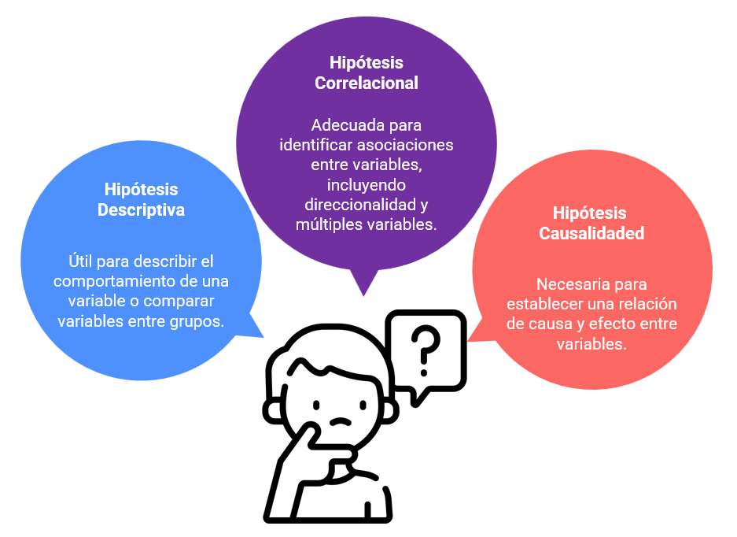{fig-align="center"}

## 3.2 Las hipótesis

### 1. Hipótesis descriptiva

-   Hipótesis descriptiva de una variable. Ejemplo: *El comportamiento de la variable Y será…*
-   Hipótesis descriptiva de una variable en dos grupos. Ejemplo: *Existe diferencia entre A y B en la variable Y*

### 2. Hipótesis correlacional

-   Hipótesis de asociación entre dos variables: *existe asociación entre X e Y…*
-   Hipótesis de asociación entre múltiples variables: *las variables X, W, Z explican el comportamiento de la variable Y*
-   Hipótesis de direccionalidad de la asociación entre dos variables: *a mayor X, mayor Y…*

### 3. Hipótesis de **causalidad** entre dos variables

-   *X determina el valor de Y …*

## Esquema de representación de variables

Para formular hipótesis, debe estar claro el papel que cumplen las variables en la investigación: - Variable dependiente (explicada) - Variable independiente (explicativa) - Variable de control (precisa la relación entre VD y VI)

Tipo de relaciones entre dos variables:

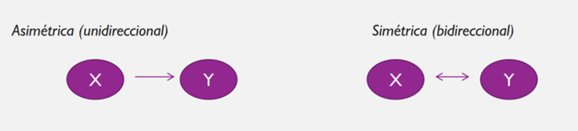{fig-align="center"}

## ¿Cuál es la variable independiente, cuál es la dependiente, son asimétricas o simétricas?

-   **Familia politizada** incide en **politización de estudiante**.
-   **Alta lectura de libros** se relaciona con **alto consumo de música**.
-   **Buena situación de salud mental** mejora el **rendimiento académico de estudiantes**.

PP: [¿Qué diferencia hay entre una v. dependiente, independiente y de control? De un ejemplo, concreto para cada una de ellas]{style="color: #4B0082;"}

## Mapa de técnicas

El tipo de hipótesis, define el tipo de análisis estadístico que realizaremos

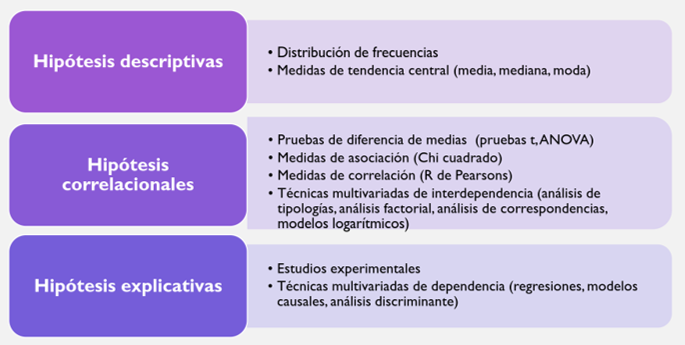{fig-align="center"}

# 04. Taller en clases {background-color="#4B0082"}

## Sobre sus trabajos

[Ver Grupos de Trabajo](https://docs.google.com/document/d/1rnPj4Ws0fRB7pyEr_-ZLg1mCBndi91PmgaAHhzh4Feg/edit?tab=t.0)

## Búsqueda booleana

-   Tener claros los descriptores de búsqueda (conceptos centrales)
-   Leer buscando esos descriptores (leer teoría y material empírico)
-   Organizar la información en función de los distintos criterios de búsqueda
-   Utilizar **DOI** (Digital Object Identifier): es un identificador único y permanente para las - publicaciones electrónica
-   Búsqueda booleana (en Google Scholar):

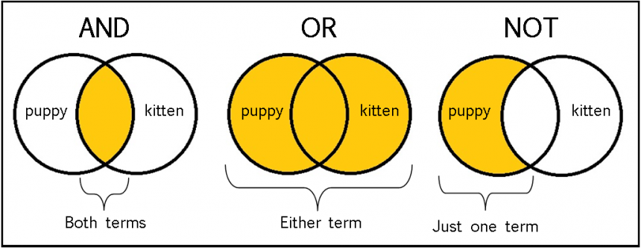{fig-align="center"}

# 

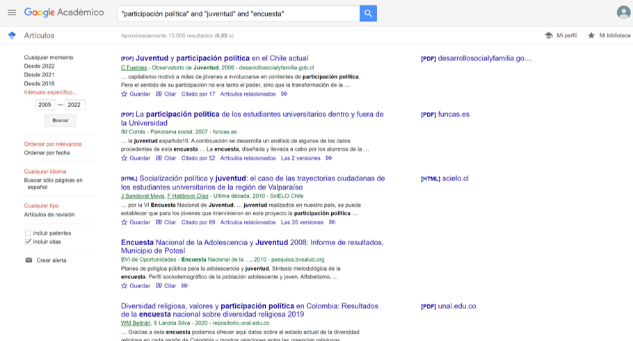{fig-align="center"} Realicen 2 búsquedas en Google Scholar por persona:

FALTA MENTIIIIIIIIIIIIIIIII

anote: a) grupo b) búsqueda \[ejemplo: (a) grupo 1; (b) “política” AND “juventud” AND “encuesta”; (c) “política” AND “encuesta” AND “participación”\]

A partir de su problema de investigación: Elabore el problema y situé la pregunta al final Determine los objetivos (1 general y 3 o 4 específicos) Postule 2 o 3 hipótesis Señale relevancias
