```{=html}
<style>
  /* 1. Ensanchar el espacio horizontal de las diapositivas */
  .reveal .slides {
    max-width: 1500px !important; /* Límite máximo para que no se deforme */
  }

  /* 2. Disminuir el tamaño de la letra del texto normal (viñetas, párrafos) */
  .reveal {
    font-size: 28px !important; /* Achica este número si lo quieres aún más pequeño */
  }

  /* 3. Disminuir el tamaño de los títulos de cada diapositiva */
  .reveal h2 {
    font-size: 45px !important;
  }
  .reveal ul, .reveal ol {
    display: block;
    width: max-content;
    margin-left: auto;
    margin-right: auto;
  }
</style>
```

---
title: "Métodos Cuantitativos I"
author: "Gino Ocampo & Sebastián Muñoz Tapia"
format: 
  revealjs:
    theme: default
    slide-number: true
editor: visual
---
## Tabla de contenidos

1.  Síntesis Prueba I\
2.  Operacionalización\
3.  Consideraciones Éticas\
4.  Ejercicio en clase y casa

# 01. Síntesis Prueba I {background-color="#4B0082"}


##

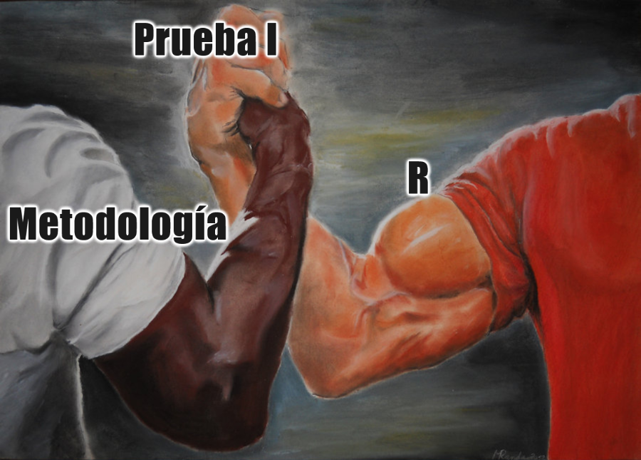{fig-align="center"}

# 02. Operacionalización {background-color="#4B0082"}


## Investigación Cuantitativa

::: {style="width: max-content; margin: 0 auto;"}
-   Introducción: Problematización, Problema, Objetivos, Hipótesis
-   Metodología
-   Marco teórico
-   [Operacionalización (Espacio bisagra entre teoría y empiria)]{style="color:red; text-decoration: underline;"}
-   Construcción de Cuestionario
-   Muestreo
-   Aplicación
-   Análisis de Datos
-   Informe final
:::

## Calidad de los datos

### ¿Son todos los fenómenos posibles de estudiar de forma cuantitativa?

### ¿Es posible construir o utilizar bases de datos adecuadas según ciertos fenómenos?

::: {.fragment}
Calidad de datos 
:::

::: {.fragment}
Buen Cuestionario
:::

## Medir en Ciencias Sociales

::: {.fragment}
> Medir en ciencias sociales se entiende como la asignación de números a objetos, atributos o rasgos de un concepto como una forma de representación de sus propiedades
:::

::: {.fragment}
> En este sentido medir es una forma de describir o caracterizar las cualidades de un concepto traduciéndolas a un lenguaje numérico que se caracteriza por su simplicidad, orden y la posibilidad de comparación en términos de magnitud.
:::

::: {.fragment}
> Para establecer correspondencia válida entre un sistema conceptual y un sistema numérico, la estructura de ambos sistemas debe ser internamente semejante (Isomorfismo).
:::


## 2.1 Medición Indirecta

 En las ciencias sociales la medición tiende a ser indirecta

::: {.fragment}
 ¿La razón?
:::

::: {.fragment}
 Medimos constructos latentes más que manifiestos
:::

::: {.fragment}
 ¿Cómo lo hacemos?
:::
 
::: {.fragment}
 a través de indicadores indirectos → a esto le llamamos ‘medición indirecta’
:::
 
::: {.fragment} 
 ¿Qué procedimiento seguimos?
:::

::: {.fragment} 
  la medición indirecta se desarrolla mediante el ‘proceso de operacionalización’
:::  

## En un cuestionario ... ¿Por qué no preguntar…?

… está usted alienado?
… tiene ustde una subjetividad neoliberal?
… es usted discriminador?

::: {.fragment} 
¿Qué otras preguntas se le ocurren que serían difíciles de hacer directamente?
:::

## ¿Por qué si se puede preguntar…?

… cuántos años tienes?

… por quién votaste en las últimas elecciones?

::: {.fragment} 
Diferencia entre conceptos simples y complejos: ¿hay acuerdo claro entre lenguaje investigador y encuestado? O ¿Es necesaria una traducción?
:::

## Lenguaje de Investigación

- Relación entre lenguaje de investigación y lenguaje de sujetos con los que se estudia

- **Conceptos simples**: conocidos y usados regularmente por sujetos investigados (e.g. edad)

- **Conceptos complejos**: menos conocidos y de uso menos común para los sujetos investigados (e.g. alienación)

## 2.2 Operacionalización

Es un proceso de traducción de **conceptos** a **indicadores**.

Tiene dos fases:

::: {.fragment} 
 > **Fase teórica** (definición conceptual de variables):\
  - Definición de un constructo complejo \
  - Desagregación del constructo en dimensiones y subdimensiones independientes entre sí
  
:::

::: {.fragment}   
 > **Fase empírica** (definición operacional de variables)\
  - Definición de conductas/hechos observables que reflejen las\ subdimensiones: definición de indicadores: los indicadores\
  - Combinación de los indicadores en índices y sub-índices
  
:::

## 2.2 Operacionalización

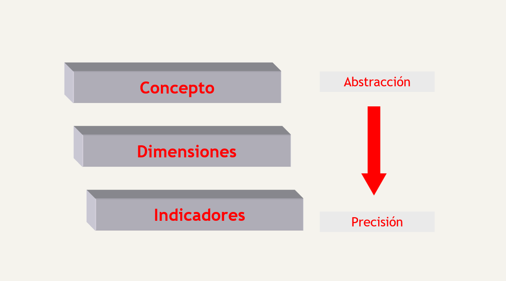{fig-align="center"}

## 2.2 Operacionalización

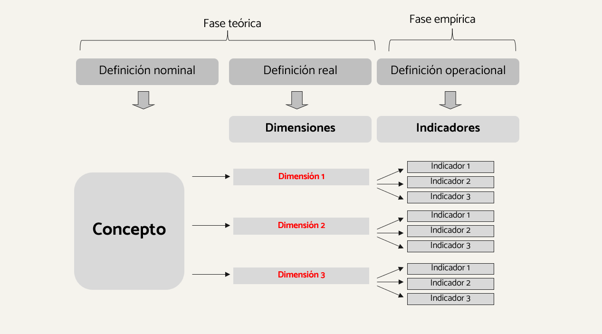{fig-align="center"}

## 2.2 Operacionalización

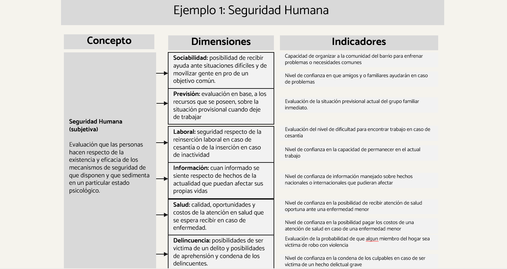{fig-align="center"}

## 2.2 Operacionalización

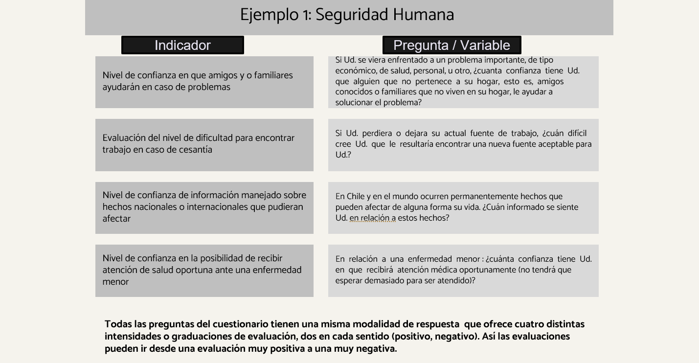{fig-align="center"}


## El proceso de Operacionalización {.smaller}

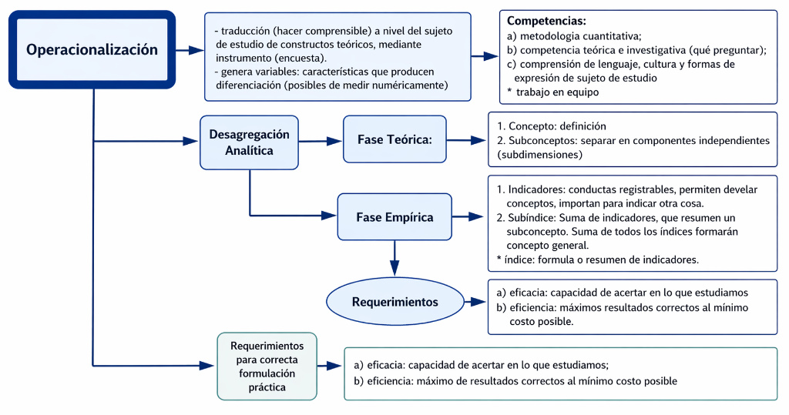{fig-align="center"}



## Para reflexionar

¿Qué riesgos tiene el proceso de operacionalización?

::: {.fragment}   
Omitir una dimensión conceptual clave
:::

::: {.fragment}   
Equivocar los indicadores
:::

::: {.fragment}   
Equivocar la ponderación de los indicadores
:::

### ¿Qué ganamos y qué perdemos al operacionalizar un concepto?... discutamos!

#

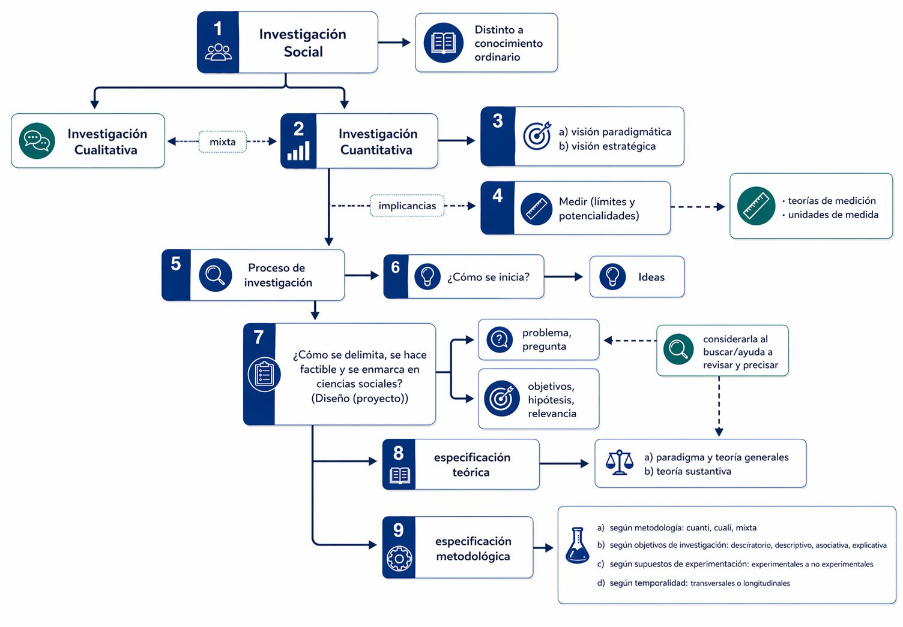{fig-align="center"}

## Tarea 3

Recuerden que en 4 semanas (26/Mayo)

**Entrega Intermedia: Marco Teórico y Metodológico, operacionalización**

Comenzar proceso de operacionalización

Para la casa: 

- Comenzar búsqueda de bibliografía (Leer)
- Hacer una ficha
- Traer fichas para hacer marco teórico

# 03. Especificación de la posición metodológica {background-color="#4B0082"}

## 03. Especificación de la posición metodológica

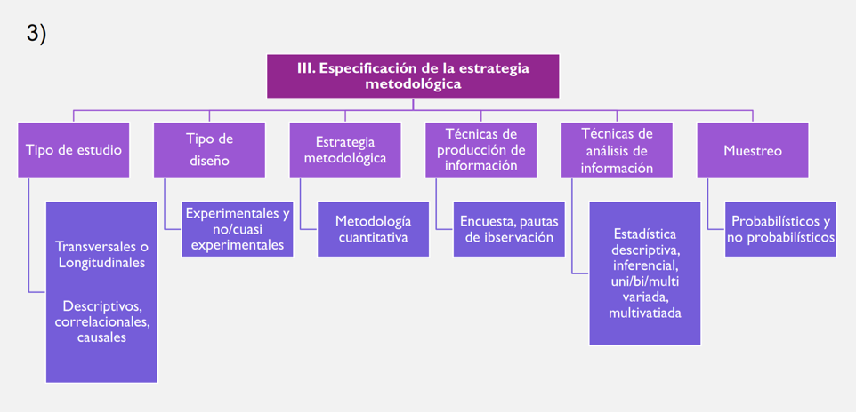{fig-align="center"}


## 3.1 Tipos de investigación según objetivos

Caracterizar la investigación de acuerdo al carácter de los objetivos de investigación
Hay distintos tipos de objetivos, que se diferencian en términos de complejidad 
Los más comunes: 

::: {.fragment}  
- Objetivos exploratorios 
:::

::: {.fragment}  
- Objetivos descriptivos
:::

::: {.fragment}  
- Objetivos asociativos
:::

::: {.fragment}  
- Objetivos explicativos 
:::


# Investigación según objetivos

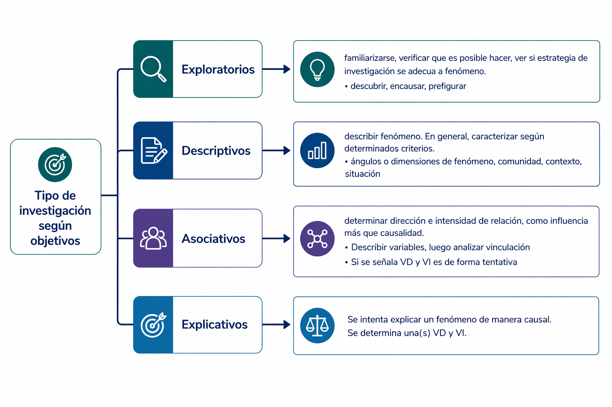{fig-align="center"}

## A. Investigación Exploratoria

- El fin es explorar un tema, familiarizarse con un tema emergente o poco estudiado\
- En general se utiliza como un paso previo a una investigación con objetivos más complejos\
- No se busca representatividad ni resultados precisos. 

- En general se usa para:

    - Familiarizarse con el fenómeno a estudiar: de qué se trata?\
    - Verificar la factibilidad de realizar una investigación más extensa: se puede investigar?\
    - Comprobar qué estrategia (o estrategias) de investigación se adecúan para estudiar el Fenómeno:\
    ¿cómo se puede investigar?\

 Ejemplo: explorar los nuevos tipos de configuración familiar.

## B. Investigación Descriptiva 

- El fin es describir un fenómeno, de manera más fiel y precisa que la simple descripción ‘casual’.\ 
- La descripción suele ser un paso previo de cualquier proceso de investigación.\
- Por lo general se utiliza cuando se quiere caracterizar a una población/un fenómeno, \
en función de determinadas características.\

- Ejemplo: CENSO; estudios de mercado (perfil de consumidor de un producto)


## C. Investigación Asociativa 

- El fin es determinar si dos variables están asociadas, determinar la dirección y la intensidad de la asociación.\ 
- No se establece causalidad. Sólo establecemos influencia entre las variables. 

Ejemplo: establecer la asociación entre felicidad y participación política

*“Los estudios correlacionales, al evaluar el grado de asociación entre las variables, primero miden cada una de ellas (presuntamente relacionadas) y las describen, y después cuantifican y analizan la vinculación.* 
*La utilidad principal de los estudios correlacionales es saber cómo se puede comportar un concepto o una variable al conocer el comportamiento de otras variables vinculadas”* 

## Peligro de Correlaciones espurias

Variables que aparentemente están vinculadas pero puede que esto no sea así.

Por ejemplo:

> Altura e inteligencia en niños/as de 6 a 12 años

## Peligro de correlaciones espurias

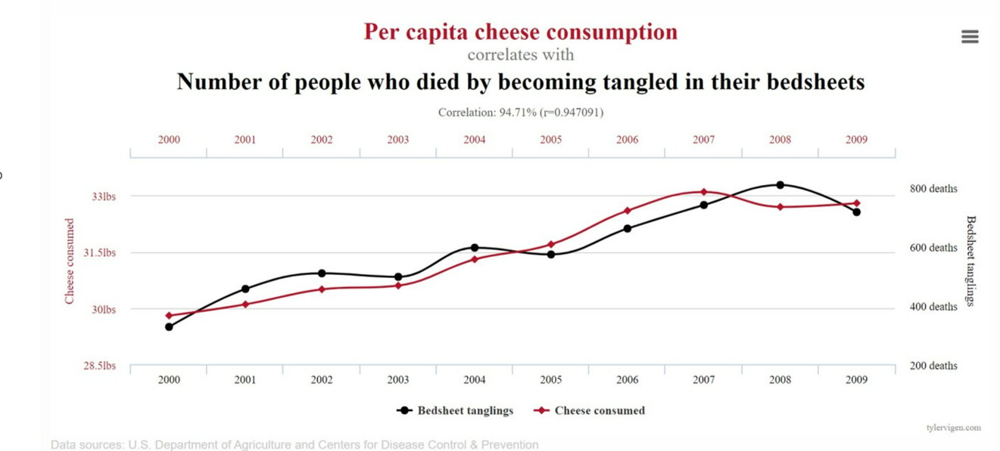{fig-align="center"}

## D. Investigación Explicativa

- El fin es explicar un fenómeno de manera causal.\ 
- ¿Qué es la causalidad? → relación empírica asimétrica, no reversible. Ejemplo: X produce Y (X → Y)\
- Se plantean hipótesis causales que para ser comprobadas requieren control de variables\
- Son las menos frecuentes pues requieren diseños demasiado complejos

Ejemplo: determinar las causas de la pobreza 


## Considerando lo anterior…

Su propuesta de investigación sería en mayor medida?: 

 - Exploratoria
 - Descriptiva
 - Asociativa
 - Causal
 
 {fig-align="right"}

## Otros tipos de investigación

Investigación **predictiva**:

> Predecir la evolución futura de un fenómeno determinado.

Investigación **evaluativa**: 

> El fin es determinar la efectividad de un programa de intervención social. 

Existen diversos tipos: 

- evaluaciones de necesidades/*ex – ante*
- evaluaciones de proceso – *durante*
- evaluaciones de impacto/*ex - post*

## 3.2 Tipos de investigación (Temporalidad)

::: {.fragment} 
1. **Diseños transversales o seccionales**

- La recogida de información se hace en un único momento. 
:::

::: {.fragment} 
2. **Diseños longitudinales**

- El análisis considera la pregunta por la evolución del problema a lo largo del tiempo.
:::

## Tipos de diseños longitudinales (a lo largo de tiempo)

::: {.fragment} 
- **De tendencia**: 

el objetivo es determinar los cambios de tendencia en el fenómeno investigado;\ 
no varía el instrumento ni la población, pero sí varía la muestra. 

> E.g. estudio de opinión política sobre aprobación/desaprobación de convención

:::

::: {.fragment} 
- **De cohorte**: 

una cohorte está constituida por *individuos que comparten una misma característica*; \ 
se hacen distintas mediciones de muestras representativas de la cohorte: 

> E.g. estudiantes matriculados 2022 en Antropología y matriculados 2023, observar nivel de ingresos a los 2 años, a los 5 años y 10 años luego de terminar la carrera. 

:::

## Tipos de diseños longitudinales (a lo largo de tiempo)

::: {.fragment} 
- **De panel**: se analiza la evolución de unos *mismos individuos*, que se eligieron al inicio de la investigación

- Temporalmente, es el diseño más ambicioso, ya que permite indagar en las causas del cambio

- Tiene varios problemas metodológicos:

:::

::: {.fragment} 

    - el desgaste de la muestra (la “atrición”)
:::

::: {.fragment} 

    - los sesgos por efecto de aprendizaje
:::

::: {.fragment} 

    -  es un diseño más caro
:::

## Tipos de diseños longitudinales (a lo largo de tiempo)

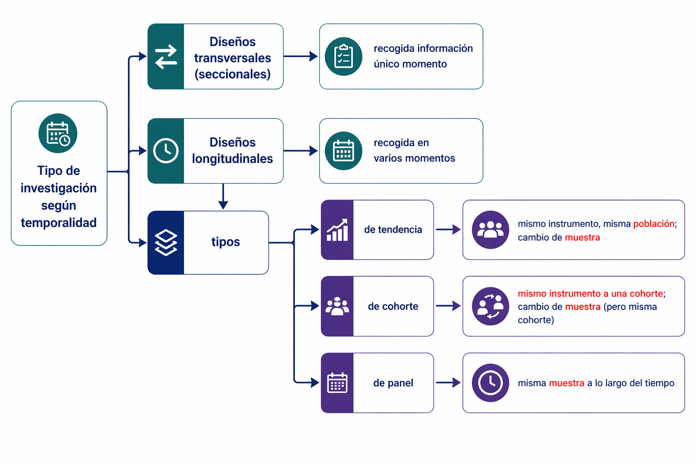{fig-align="center"}
## 3.3 Tipos de diseño

Los distintos diseños → especifican el grado en que se cumplen los supuestos de experimentación en una investigación:

1. Especifican el **poder explicativo que es posible esperar de la investigación**

2. Implican **grados variables de intervención** sobre la situación que se va a investigar

3. Esto se traduce en el nivel de **control de las variables** y **selección de muestra**

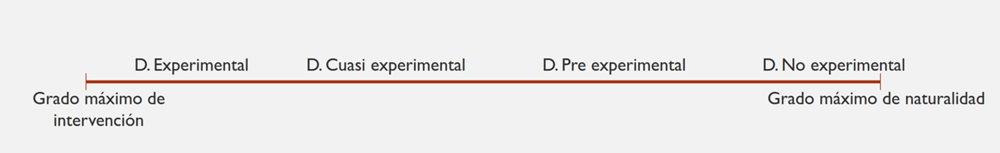{fig-align="center"}


## 3.3 Tipos de diseño (validez)

Esto afecta la **validez** de las investigaciones. Hay dos tipos de validez:

::: {.fragment} 
- **Validez Interna**: posibilidad de establecer relaciones de causalidad entre variables, \
capacidad de atribuir el cambio en la VD a variaciones de la VI.
:::

::: {.fragment} 
- **Validez externa**: posibilidad de generalización de los resultados de una investigación
:::

::: {.fragment} 
En general: **a mayor validez interna, disminuye la validez externa.**
:::


## Tarea 3

Comenzar proceso de operacionalización

Para la casa: 

- Desde ya, comienzo a buscar bibliografía (Para Antecedentes y Marco Teórico)\
- Hacer una ficha\
- Traer fichas para hacer marco teórico\

## Tarea 3: Elicit & AA

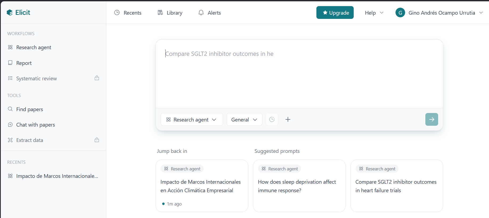{fig-align="center"}
