```{=html}
<style>
  /* 1. Ensanchar el espacio horizontal de las diapositivas */
  .reveal .slides {
    max-width: 1500px !important; /* Límite máximo para que no se deforme */
  }

  /* 2. Disminuir el tamaño de la letra del texto normal (viñetas, párrafos) */
  .reveal {
    font-size: 28px !important; /* Achica este número si lo quieres aún más pequeño */
  }

  /* 3. Disminuir el tamaño de los títulos de cada diapositiva */
  .reveal h2 {
    font-size: 45px !important;
  }
  .reveal ul, .reveal ol {
    display: block;
    width: max-content;
    margin-left: auto;
    margin-right: auto;
  }
</style>
```

---
title: "Métodos Cuantitativos I - Clase 8"
author: "Gino Ocampo & Sebastián Muñoz Tapia"
format: 
  revealjs:
    theme: default
    slide-number: true
editor: visual
---

## Tabla de contenidos

1.  Escalas de Medición
2.  Índices
3.  Ejemplo Operacionalización

# 01. Escalas de Medición {background-color="#00718A"}

## Escalas de Medición en la investigación Cuantitativa

### Consutruccción de cuestionarios y escalas

*Asun, R. (2006). Construcción de cuestionarios y escalas:*
*El proceso de la producción de información cuantitativa. pp. 77–113*

## 1. ¿Qué es una escala de medición?
::: fragment
> Una escala es un conjunto de ítems o reactivos que permiten medir un concepto
abstracto (variable latente) que no puede observarse directamente, asignando
valores numéricos según reglas definidas.

:::

### Diferencia con una pregunta simple
::: fragment
> Una pregunta simple mide una sola dimensión observable

:::

::: fragment
> Una escala combina múltiples ítems para captar la complejidad 
de un constructo latente.

::: 

::: fragment
Ejemplo

Medir "satisfacción laboral" requiere varios ítems sobre salario, ambiente, autonomía, etc.
:::

## Niveles de medición

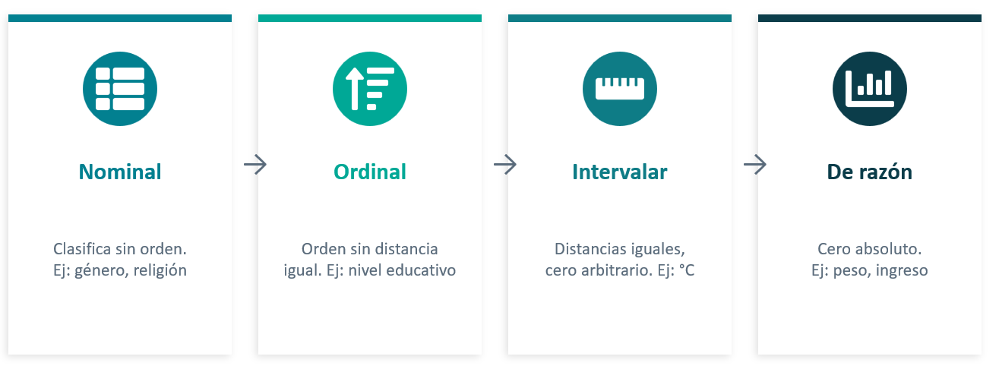{fig-align="center"}
Mayor nivel de medición → mayor cantidad de operaciones estadísticas posibles

## Escaka tipo Likert

Mide el grado de acuerdo o desacuerdo con una afirmación. Es la escala más utilizada en ciencias sociales por su simplicidad y versatilidad.

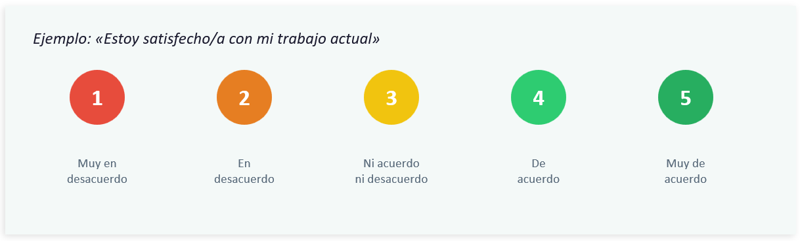{fig-align="center"}

::: fragment
Características:

> Formato sumativo (se suman los puntajes de cada ítem), generalmente 5 o 7 categorías de respuesta, permite detectar intensidad de actitudes.

::: 

## Diferencial Semántico

Escala bipolar que evalúa un concepto mediante pares de adjetivos opuestos. Creada por Osgood, Suci y Tannenbaum.

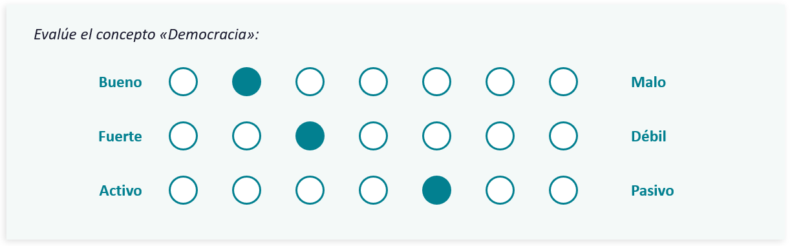{fig-align="center"}

**Tres dimensiones fundamentales:**

::: fragment
{fig-align="center"}
::: 

## Proceso de construcción de una escala

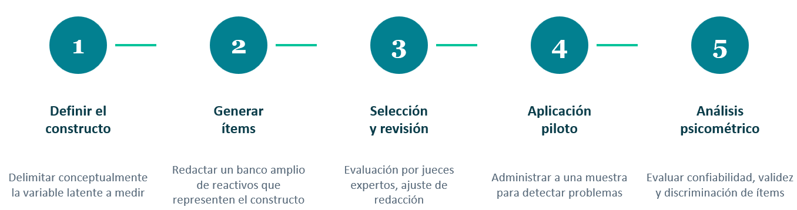{fig-align="center"}

**Consideraciones clave:**

::: fragment
- Evitar ítems ambiguos, con doble negación o carga emocional excesiva.
:::

::: fragment
- Incluir ítems directos e inversos para controlar aquiescencia[^1].
:::

::: fragment
- Mantener un lenguaje accesible al nivel de la población objetivo.
:::

[^1]: tendencia de algunas personas a responder “de acuerdo” a todo, sin pensar demasiado.

## Confiabilidad y Validez

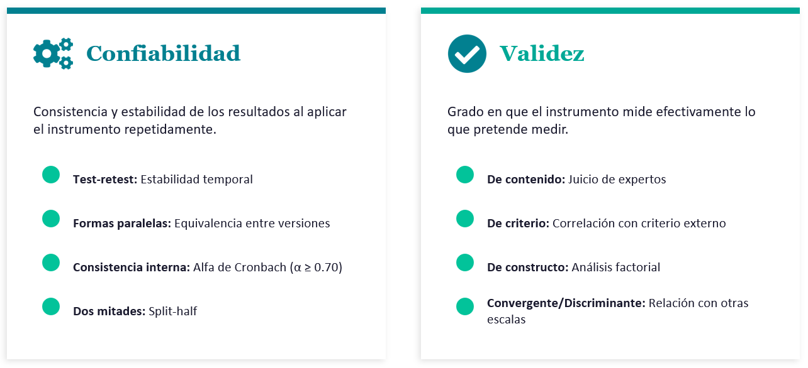{fig-align="center"}

## Errores frecuentes en la construcción de escalas

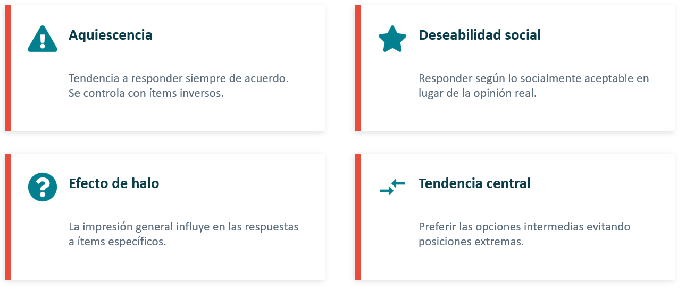{fig-align="center"}

# Síntesis {background-color="#00718A"}

::: fragment
Las escalas permiten cuantificar constructos abstractos que no son directamente observables.
:::

::: fragment
La elección del tipo de escala depende del constructo, los objetivos de investigación y la población.
:::

::: fragment
Una buena escala debe cumplir criterios de confiabilidad y validez.
:::

::: fragment
El proceso de construcción es iterativo y requiere pruebas empíricas rigurosas.
:::

# 02. Índices {background-color="#00718A"}

## ¿Qué es un índice?

::: fragment
Un índice es una fórmula que combina un conjunto de preguntas con el objeto de producir **una sola puntuación** (valor que indicará el grado en que los sujetos de estudio poseen un concepto latente.
:::

::: fragment
*“Por índice se entiende… una variable unidimensional con x valores sobre la que se representan las v clases de posibles combinaciones de atributos extraidos del espacio pluridimensional ”* (Mayntz, Holm & Hübner, 2004:61)
:::

::: fragment
El modo de construcción es **arbitrario** (pero justificado)
:::

::: fragment
Lo utilizamos cuando **requerimos varios indicadores para medir un solo constructo** (por su naturaleza
:::

## Índices

• Etapas de construcción de un Índice:

::: fragment
1. Definir dimensiones y subdimensiones analíticas
:::

::: fragment
2. Definir indicadores empíricos
:::

::: fragment
3. Definir una unidad de medida común entre indicadores
:::

::: fragment
4. Definir un procedimiento de ponderación
:::

::: fragment
5. Construir subíndices y el índice global
:::

::: fragment
• Fuentes posibles de datos
 - Datos secundarios
 - Datos primarios
 
::: 

## Definición de Dimensiones e Indicadores

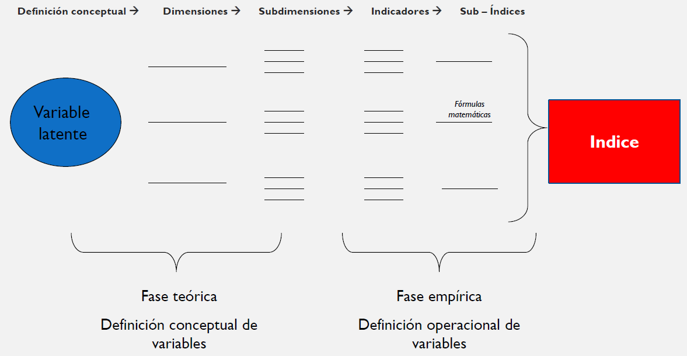{fig-align="center"}

## Indicadores

::: fragment
Los criterios para seleccionar indicadores son:
:::

::: fragment
**Sensibilidad** (si el fenómeno cambia, el indicador debe cambiar con él)
:::

::: fragment
**Pertinencia teórica y empírica** (los indicadores deben relacionarse con el concepto)
:::

::: fragment
**Fiabilidad** (deben ser confiables, verificar que no haya manipulación de
información)
:::

::: fragment
**Disponibilidad, capacidad de actualización y costo**
:::


## Medida Común y Ponderación

::: fragment
> Los indicadores de un índice deben expresarse en una **medida común** 
para poder ser agregados, por lo que es necesario considerar
procedimientos de conversión de la unidad de medida de variables

:::

::: fragment
> Además, los índices pueden ser autoponderados o podemos asignar
**pesos diferente** a los indicadores de acuerdo a su relevancia, por lo
que hay que considerar también procedimientos de ponderación

:::


## Medida Común y Ponderación

Fórmulas para generar una medida común en variables intervalares

$$z = \frac{x - \bar{X}}{s}$$

Estandarización de 0 a 1, sobre límite teórico

$$\frac{\text{Valor observado} - \text{valor límite inferior}}{\text{valor límite superior} - \text{valor límite inferior}}$$


Proporciones de 100, sobre límite empírico

$$\frac{\text{valor observado} \times 100}{\text{máximo valor observado}}$$

## Medida Común y Ponderación

Fórmulas para generar una medida común en variables ordinales o
nominales (dicotómicas)

- Estandarización de 0 a 1, sobre límite teórico (variables ordinales)

$$\frac{Valor observado - límite inferior}{valor límite superior - valor límite inferior}$$

- Utilizar como patrón la escala con mayor rango de alternativas (variables ordinales y dicotómicas)


## Método de agregación

• Fórmula más básica (índice aditivo sin ponderación)

$$índice=\frac{Pregunta 1+ Pregunta 2 +  Pregunta 3...+ Pregunta X }{X}$$
- Criterios de ponderación:

• Realizar sólo si hay indicaciones teóricas fuertes
• Fórmula ponderada

Índice= ( Pregunta1 * 0, 3 + Pregunta 2 * 0,4 + Pregunta 3 * 0,2 + Pregunta x4 * 0,…)

## Usos y ventajas de los índices

::: fragment
• Permiten comparabilidad rápidamente
:::

::: fragment
• Pueden ser usados en distintos lugares
:::

::: fragment
• Resumen mucha información en un número (facilitan la toma de decisiones)
:::

::: fragment
• Además de su uso académico, permiten justificar políticas públicas y evaluar
líneas base
:::

## Ejemplo índice construido con datos primarios de encuesta

índice de Seguridad Humana Subjetiva, PNUD 2012

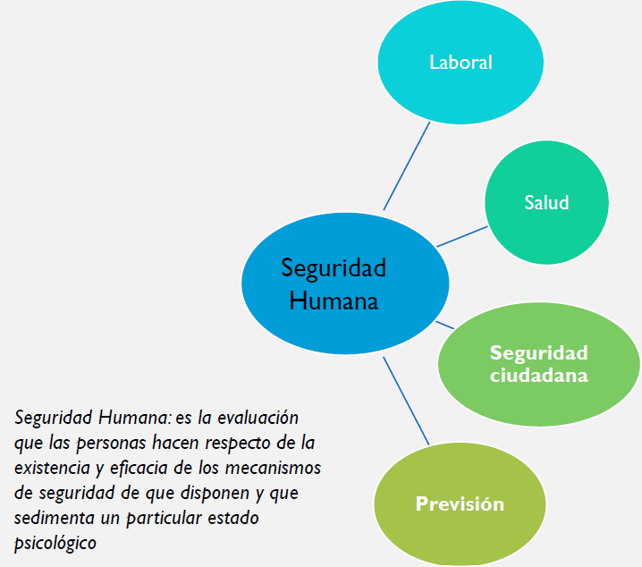{fig-align="right"} 

# 03. Ejemplo de Operacionalización {background-color="#00718A"}

 
## Ejemplo de operacionalización "Seguridad Humana Subjetiva"

**Objetivo de la investigación**

*‘Conocer el nivel de seguridad humana subjetiva de los chilenos’*

• **Definición teórica** de seguridad humana subjetiva (en el marco teórico)

*‘Es la evaluación que las personas hacen respecto de la existencia y eficacia de los mecanismos de seguridad de que disponen y que sedimenta un particular estado psicológico’ *(IDH, 1998)

• **Definición nominal** de la variable ‘nivel de seguridad humana subjetiva’ (al final del marco teórico):

*‘Es la evaluación que hacen las personas de la existencia y eficacia de los mecanismos de seguridad de que disponen en los siguientes ámbitos: laboral, salud, seguridad ciudadana y previsión’* [en la versión original incluye también cultura y relaciones sociales]

• **Definición operacional** ‘nivel de seguridad humana subjetiva’:

*El nivel de seguridad humana subjetiva será medido a partir del puntaje total que resulte de la sumatoria de los puntajes obtenidos en cada uno de los siguientes indicadores*

## Indicadores

• El índice original (año 1998) tenía 20 indicadores (y 6 dimensiones).

• El año 2011 se replica en versión abreviada (9 indicadores, 4 dimensiones), dejando
las dimensiones e indicadores que más discriminan.

## Dimensiones, subdimensiones e indicadores del índice

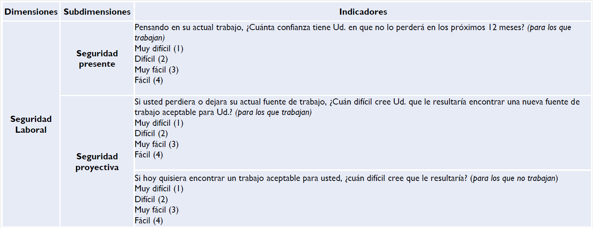{fig-align="center"} 

## Dimensiones, subdimensiones e indicadores del índice

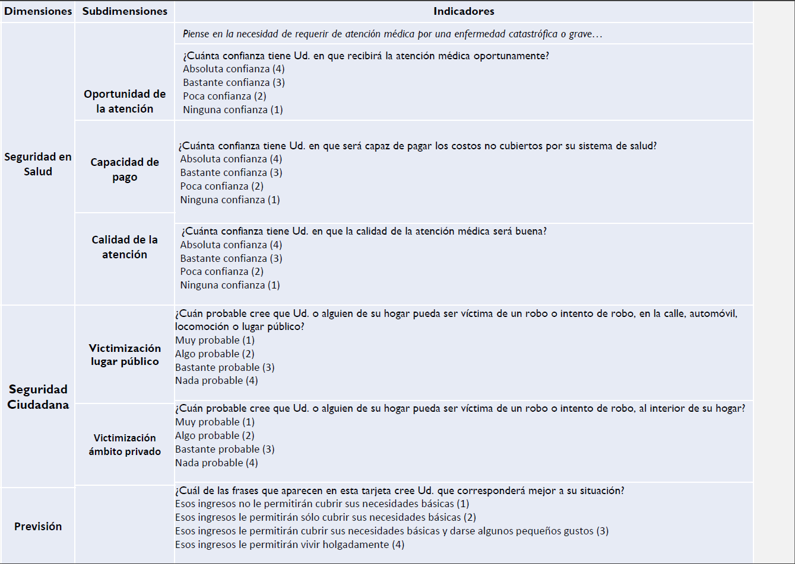{fig-align="center"}

## Metodología de agregación

::: fragment
• Se codifican todos los indicadores de modo que 1 signifique seguridad y 4 inseguridad
:::

::: fragment
• Se dicotomizan los 9 indicadores, agrupando las 4 categorías en 2.
• Categorías:
• Seguro (1)
• Inseguro (0)
:::

::: fragment
• Se realiza una sumatoria aditiva y se divide por el total de indicadores (9 para el caso de los ocupados y para el caso de los desocupados)
:::

::: fragment
• Se estandariza el índice global en el rango de 0 a 1
:::

## Ejemplo índice de Desarrollo Humano

- El Desarrollo Humano es el proceso mediante el cual se aumentan las capacidades y opciones de las personas para que éstas puedan perseguir la realización del tipo de vida que les parezca valiosa.

- El índice de Desarrollo Humano se concentra en medir las capacidades en 3 dimensiones esenciales:

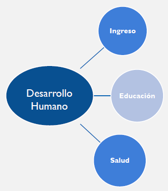{fig-align="center"}

## Metodología y Fuentes IDH (GLOBAL)

| **Dimensiones** | **Indicadores**                  |
|-----------------|----------------------------------|
| **Salud**       | Esperanza de vida al nacer       |
| **Educación**   | Años promedio de escolaridad     |
|                 | Años esperados de escolarización |
| **Ingresos**    | INB per cápita                   |


## Metodología y Fuentes IDH (GLOBAL)

```{r}
#| echo: false
#| warning: false 
#| message: false
library(gt)
library(dplyr)

datos <- data.frame(
  Dimensiones = c("Salud", "Educación", "Educación", "Ingresos", "Ingresos", "Ingresos"),
  Indicadores = c(
    "Años de vida potencial perdidos por cada mil habitantes menores de 80 años.",
    "Media de escolaridad de la población mayor de 24 años.",
    "Tasa de cobertura bruta de la población entre 4 y 25 años.",
    "Promedio de ingreso autónomo per cápita de hogares, ajustado",
    "Proporción de la población bajo la línea de la pobreza",
    "Coeficiente Gini (sólo a nivel regional)"
  ),
  Fuentes_de_informacion = c(
    "Registros administrativos MINSAL",
    "CASEN/ MINEDUC",
    "CASEN / MINEDUC",
    "CASEN",
    "CASEN",
    "CASEN"
  )
)

datos %>%
  gt() %>%
  cols_label(
    Dimensiones = "Dimensiones",
    Indicadores = "Indicadores",
    Fuentes_de_informacion = "Fuentes de información"
  ) %>%
  tab_style(
    style = cell_text(weight = "bold"),
    locations = cells_column_labels()
  )
```

## METODOLOGÍA DE AGREGACIÓN DEL IDH

El nivel de logro de cada dimensión se calcula contrastando los valores observados
de cada variable con valores mínimos y máximos normativos definidos para cada
indicador:

$$\text{índice de la dimensión} = \frac{\text{valor observado} - \text{valor mínimo}}{\text{valor máximo} - \text{valor mínimo}}$$

El IDH final es la agregación de la media geométrica de los subíndices de Salud,
Educación e Ingreso disfrutar de una vida larga y saludable, acceso a educación y
nivel de vida digno

$$IDH = \sqrt[3]{I_{\text{Salud}} \times I_{\text{Educación}} \times I_{\text{Ingreso}}}$$

## Tipo de análisis que permite

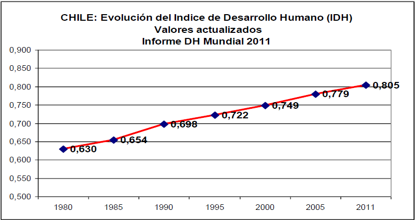{fig-align="center"}

## Tipo de análisis que permite

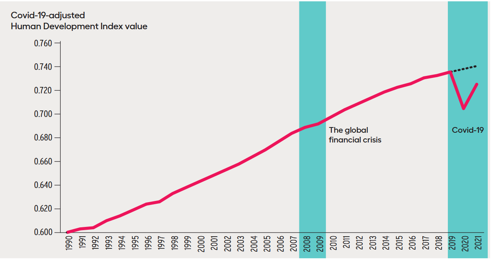{fig-align="center"}

## Reflexión

¿Hay constructos en su investigación que deban ser medidos a partir de más de
un indicador? ¿Por qué?