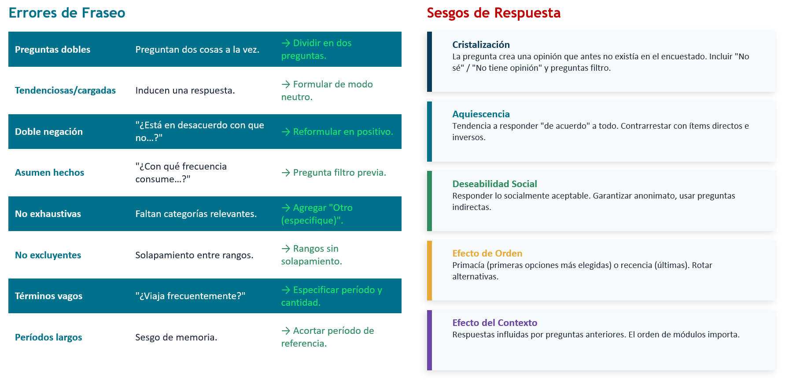

```{=html}
<style>
  /* 1. Ensanchar el espacio horizontal de las diapositivas */
  .reveal .slides {
    max-width: 1500px !important; /* Límite máximo para que no se deforme */
  }

  /* 2. Disminuir el tamaño de la letra del texto normal (viñetas, párrafos) */
  .reveal {
    font-size: 28px !important; /* Achica este número si lo quieres aún más pequeño */
  }

  /* 3. Disminuir el tamaño de los títulos de cada diapositiva */
  .reveal h2 {
    font-size: 45px !important;
  }
  .reveal ul, .reveal ol {
    display: block;
    width: max-content;
    margin-left: auto;
    margin-right: auto;
  }
</style>
```

---
title: "Métodos Cuantitativos I - Clase 9"
author: "Gino Ocampo & Sebastián Muñoz Tapia"
format: 
  revealjs:
    theme: default
    slide-number: true
editor: visual
---

## Tabla de contenidos

1. Fuentes de información cuantitativa
2. La encuesta y el cuestionario: estructura y componentes
3. Tipos de pregunta según contenido
4. Tipos de pregunta según tipo de respuesta
5. Tipos de pregunta según categorías de respuesta
6. Fraseo de preguntas y cristalización
7. Errores comunes y recomendaciones
8. Síntesis

# 01. Fuentes de información cuantitativa {background-color="#00718A"}

## Fuentes de información cuantitativa 

- Además de especificar el tipo de estudio, tipo de diseño, estrategia metodológica y estrategia muestral, \
el marco metodológico debe especificar cual es el **instrumento** que se utilizará para producir información.

[**Generar datos!**]{style="color: #00718A;"}

En el marco de la metodología cuantitativa, debe ser un instrumento que permita traducir [**fenómenos sociales a números**]{style="color: #00718A;"}. Hay diversas alternativas, según el tipo de objeto que estemos estudiando

{fig-align="center"}

# ¿Cómo se produce información cuantitativa? {background-color="#00718A"}

## ¿De dónde vienen los números que analizamos?

La investigación cuantitativa utiliza números mediante procesos de medición, codificación, análisis y selección de sujetos (Asún, en Canales, 2006). La pregunta clave es: ¿cómo generamos esos números?

Existen dos grandes caminos:

::: fragment
Datos primarios: producidos directamente por el investigador para responder su pregunta de investigación.
:::

::: fragment
Datos secundarios: producidos por otros (instituciones, investigadores previos) y reutilizados con un nuevo propósito analítico.
:::

# Múltiples formas de producir información cuantitativa {background-color="#00718A"}

## Panorama de fuentes de información cuantitativa

A. Datos primarios [(el investigador los produce)]{style="color: #00718A;"}

| Técnica | Descripción | Ejemplo |
|---|---|---|
| **Encuesta (cuestionario)** | Instrumento estandarizado aplicado a una muestra. Presencial, telefónica u online. | Encuesta sobre participación política a estudiantes universitarios |
| **Observación estructurada** | Registro sistemático de conductas con pauta de codificación predefinida. | Contar frecuencia de interacciones en sala de clases |
| **Experimento / cuasi-experimento** | Manipulación controlada de variables para medir efectos causales. | Efecto de un estímulo informativo sobre actitudes hacia la inmigración |
| **Test o escala estandarizada** | Instrumentos validados para medir constructos psicológicos o sociales. | Escala de autoeficacia, test de autoritarismo |

## Panorama de fuentes de información cuantitativa

B. Datos secundarios [(producidos por otros)]{style="color: #00718A;"}

| Fuente | Descripción | Ejemplo en Chile |
|---|---|---|
| **Encuestas preexistentes** | Grandes encuestas nacionales o internacionales disponibles para análisis. | CASEN, CEP, Latinobarómetro, ELSOC, World Values Survey |
| **Registros administrativos** | Datos generados por instituciones en su gestión cotidiana. | MINSAL (defunciones, egresos hospitalarios), MINEDUC (matrícula, SIMCE), SII, Registro Civil |
| **Censos** | Registro exhaustivo de una población en un momento determinado. | Censo de Población y Vivienda (INE) |
| **Datos digitales / Big Data** | Información generada por la actividad digital de las personas. | Datos de redes sociales, tráfico web, registros de Spotify, GPS |


## Web scraping y nuevas fuentes digitales

En el contexto de la digitalización y el Big Data (las 3 V: volumen, velocidad, variedad):
Web scraping: Extracción automatizada de datos desde páginas web mediante programación (Python, R). Permite convertir información no estructurada (texto, imágenes, metadatos) en bases de datos cuantificables.
Ejemplos de aplicación en ciencias sociales:

::: fragment
> Análisis de precios de arriendo en portales inmobiliarios

:::

::: fragment
> Monitoreo de discurso político en prensa digital

:::
::: fragment
> Análisis de redes de recomendación en YouTube (como en el ejemplo de la clase 1 sobre música urbana)

:::
::: fragment
> Procesamiento de lenguaje natural (NLP) sobre letras de canciones o tweets

:::

**Consideraciones éticas y metodológicas**: términos de servicio, consentimiento informado en entornos digitales, representatividad de los datos, sesgo algorítmico.


## ¿Cuándo usar cada fuente?

Criterios de decisión:

::: fragment
- Pregunta de investigación: ¿Requiere información que ya existe o información nueva?
:::

::: fragment
- Recursos disponibles: Tiempo, dinero, acceso a la población.
:::

::: fragment
- Nivel de control: ¿Necesito controlar cómo se formulan las preguntas?
:::

::: fragment
- Especificidad: ¿Mis variables/indicadores están ya medidos en fuentes existentes?
:::

[En su investigación grupal, ¿utilizarán datos primarios, secundarios o ambos? ¿Por qué?]{style="color: #00718A;"}

# 02. La encuesta y el cuestionario: estructura y componentes {background-color="#00718A"}

##  La encuesta como técnica de producción de información

La [encuesta]{style="color: #00718A;"} es una técnica de recolección de datos que utiliza un cuestionario\ estandarizado aplicado a una muestra de individuos, con el fin de obtener información\ cuantificable sobre hechos, opiniones, actitudes o comportamientos.

Características fundamentales:

::: fragment
> **Estandarización**: mismas preguntas, mismo orden, mismas opciones para todos.

:::
::: fragment
> Permite **generalización** (si el muestreo es adecuado).

:::
::: fragment
> Produce datos **comparables** entre sujetos.

:::
::: fragment
> Es la técnica más utilizada en ciencias sociales cuantitativas.

:::

## La encuesta como técnica de producción de información

Modalidades de aplicación:

::: fragment
**CAPI** [(Computer-Assisted Personal Interviewing)]{style="color: #00718A;"}
> Encuesta presencial cara a cara en la que el/la encuestador/a registra las respuestas directamente en un dispositivo electrónico (tablet, notebook o celular).

:::
::: fragment
**CATI** [(Computer-Assisted Telephone Interviewing)]{style="color: #00718A;"}
> Encuesta telefónica asistida por computador, donde el/la entrevistador/a sigue un cuestionario digital y registra las respuestas en tiempo real.

:::
::: fragment
**PAPI** [(Paper and Pencil Interviewing)]{style="color: #00718A;"}Autoadministrada en papel 
> Cuestionario respondido directamente por la persona encuestada en formato papel, sin mediación tecnológica.

:::
::: fragment
**CAWI** [(Computer-Assisted Web Interviewing)]{style="color: #00718A;"}
> Encuesta online respondida mediante internet desde computador o celular.
Ejemplos de plataformas: Google Forms, SurveyMonkey, Qualtrics, LimeSurvey, E-encuestas.

:::

## Estructura general de un cuestionario

Un cuestionario bien diseñado tiene las siguientes secciones:

::: fragment
1. Presentación / consentimiento informado: Quién investiga, para qué, confidencialidad, voluntariedad.
:::

::: fragment
2. Preguntas filtro o de clasificación inicial: Verifican que el encuestado cumple los criterios de inclusión.
:::
::: fragment
3. Módulos temáticos: Agrupados por dimensión/variable. Van de lo más general a lo más específico, \
de lo menos sensible a lo más sensible.
:::
::: fragment
4. Datos sociodemográficos: Generalmente al final (edad, sexo, nivel educacional, ingreso, etc.).\
Excepción: si son variables filtro, van al inicio.
:::
::: fragment
5. Cierre y agradecimiento.
:::
::: fragment
**Principio general**: El cuestionario es la traducción empírica de la tabla de operacionalización. Cada indicador se convierte en una o más preguntas.
:::

# 03. TIPOS DE PREGUNTA SEGÚN CONTENIDO {background-color="#00718A"}

## ¿Qué queremos medir? Tipos de pregunta según [*contenido*]{style="color: #00718A;"}

El contenido de una pregunta se define por el tipo de fenómeno que busca captar. Siguiendo a Cea D'Ancona (1998) y Asún (2006):

1. **Preguntas de hechos (o conductas)**
Indagan sobre características objetivas o comportamientos\
verificables del encuestado.

- *¿Cuántos años tiene usted?*
- *¿Votó en las últimas elecciones municipales?*
- *¿Cuántas horas a la semana dedica a estudiar?*
- *¿En qué comuna reside actualmente?*

**Ventaja**: Menor ambigüedad, respuestas más confiables.
**Riesgo**: Sesgo de memoria, deseabilidad social en conductas sensibles (ej. consumo de drogas).

## Tipos de pregunta según contenido

2. **Preguntas de aptitudes o conocimientos**

Evalúan lo que la persona sabe o es capaz de hacer. Tienen respuestas **correctas e incorrectas**.

- *¿Sabe usted quién es el actual presidente del Senado?*
- *¿Cuál de las siguientes es una función del Banco Central?*
- *Verdadero o Falso: "El PIB mide el bienestar de la población"*

**Uso en ciencias sociales**: Medir alfabetización política, conocimiento financiero, comprensión de derechos, etc.
**Precaución**: Pueden generar incomodidad o resistencia en el encuestado si se percibe como "examen". Incluir opciones como "No sé" para evitar respuestas al azar.

## Tipos de pregunta según contenido

**3. Preguntas de actitudes**
Buscan captar predisposiciones evaluativas relativamente estables hacia objetos, personas o situaciones.

- *¿Qué tan de acuerdo está con la afirmación: "La inmigración enriquece*\
*culturalmente a Chile"? (Muy de acuerdo... Muy en desacuerdo)*

**4. Preguntas de opiniones**
Captan juicios o valoraciones puntuales, menos estables que las actitudes.

- *¿Cree usted que el gobierno actual está haciendo un buen trabajo en materia de seguridad?*

**5. Preguntas de valores**
Indagan sobre principios o ideales que guían la conducta.

- *¿Qué es más importante para usted: la libertad individual o la igualdad social?*

**Nota conceptual**: La distinción entre actitud, opinión y valor es analítica. En la práctica, muchas preguntas combinan elementos de las tres. Lo importante es tener claridad sobre qué constructo se está midiendo y cómo se vincula con la operacionalización.

# 04. Tipos de pregunta según tipo de respuesta {background-color="#00718A"}

## Preguntas abiertas

No se ofrecen alternativas de respuesta. El encuestado responde con sus propias palabras.

**Ejemplo**:

- *¿Cuál es, en su opinión, el principal problema del país?*

- *¿Qué entiende usted por "calidad de vida"?*

::: fragment
**Ventajas**:

- Riqueza de información, captan matices no previstos.

- Útiles en etapas exploratorias o como complemento.
:::
::: fragment
**Desventajas**:

- Difíciles de codificar y analizar cuantitativamente (requieren post-codificación).

- Más tiempo de respuesta y de procesamiento.

- Mayor tasa de no respuesta.
:::
::: fragment
**Uso recomendado**: En pretest o pilotaje, para descubrir categorías que luego se cerrarán.
:::

## Preguntas cerradas

Se ofrecen todas las alternativas de respuesta posibles. El encuestado elige una o más.

::: fragment
**Ejemplo (selección única)**:

- *¿Cuál es su estado civil? (Soltero/a, Casado/a, Conviviente, Separado/a, Viudo/a)*

::: 

::: fragment
**Ejemplo (selección múltiple)**:

- *¿Cuáles de los siguientes medios utiliza para informarse? (Marque todas las que apliquen)*

    - Televisión / Redes sociales / Prensa escrita / Radio / Podcasts / Otros
::: 

::: fragment
**Ventajas**:

- Facilitan codificación, comparabilidad y análisis estadístico.
- Menor tiempo de respuesta.
::: 
::: fragment
**Desventajas**:

- Pueden forzar opciones que no representan al encuestado.
- Riesgo de omitir alternativas relevantes.
::: 

## Preguntas cerradas

::: fragment
**Regla clave**: Las categorías deben ser **exhaustivas** (cubrir todas las posibilidades) y **mutuamente excluyentes** (cada caso cabe en una sola categoría). Cuando no se puede garantizar exhaustividad, incluir "Otro (especifique)".
::: 

## Preguntas Mixtas

Combinan alternativas cerradas con una opción abierta

::: fragment
Ejemplo:

- *¿Cuál es su principal fuente de ingresos?*

a) Trabajo dependiente \
b) Trabajo independiente \
c) Beca o mesada \
d) Pensión \
e) Otro: ___________
::: 
::: fragment
*Ventaja*: Equilibran estandarización con flexibilidad. Son la opción más recomendada cuando no se tiene certeza total de todas las categorías posibles.
::: 

# 05. TIPOS DE PREGUNTA SEGÚN CATEGORÍAS DE RESPUESTA {background-color="#00718A"}

## Categorías de respuesta y niveles de medición

Recordar de clases anteriores: mayor nivel de medición → mayor cantidad de operaciones estadísticas posibles.
La forma en que diseñamos las categorías de respuesta determina el nivel de medición de la variable resultante:

| Tipo de categoría | Nivel de medición | Propiedad | Ejemplo |
|---|---|---|---|
| **Dicotómica** | Nominal | Clasificación en 2 grupos | Sí / No |
| **Politómica nominal** | Nominal | Clasificación en 3+ grupos sin orden | Religión: Católica / Evangélica / Ninguna / Otra |
| **Ordinal** | Ordinal | Orden entre categorías, distancia desconocida | Muy en desacuerdo / En desacuerdo / De acuerdo / Muy de acuerdo |
| **Intervalar (tipo Likert)** | Ordinal (tratado como intervalar) | Se asume distancia equivalente entre puntos | Escala de 1 a 7 donde 1 = Nada satisfecho, 7 = Totalmente satisfecho |
| **De razón (numérica directa)** | Razón | Tiene cero absoluto | ¿Cuántos hijos tiene? / ¿Cuál es su ingreso mensual en pesos? |

## Preguntas dicotómicas
*
**Estructura**: Solo dos opciones de respuesta.

::: fragment
Ejemplos:

- *¿Tiene usted hijos?* → Sí / No
- *¿Participó en la última elección?* → Sí / No
- *¿Está actualmente empleado/a?* → Sí / No
:::

::: fragment
**Ventajas**: Máxima claridad, fácil codificación (0/1), útiles para variables filtro.
:::
::: fragment
**Limitación**: Simplifican realidades complejas. No captan intensidad ni matices.
:::

::: fragment
**Consejo**: Son ideales como "puerta de entrada" antes de preguntas de profundización.
:::

::: fragment
**Ejemplo**: *"¿Tiene hijos?"* → Si responde Sí → "¿Cuántos?"
:::

##  Preguntas con respuesta ordinal

**Estructura**: Categorías con un orden lógico, pero sin distancia conocida entre ellas.

::: fragment
Ejemplo:

*¿Con qué frecuencia participa en actividades extracurriculares?*

    Nunca / Rara vez / A veces / Frecuentemente / Siempre
:::

::: fragment
**Ejemplo clásico: Escala Likert**

*"Las redes sociales mejoran la calidad de la democracia"*

     Muy en desacuerdo (1) / En desacuerdo (2) / Ni de acuerdo ni en desacuerdo (3) / De acuerdo (4) / Muy de acuerdo (5)
:::    

::: fragment
**Nota metodológica**: ¿Son realmente intervalares las Likert? Estrictamente son ordinales (no sabemos si la distancia entre "de acuerdo" y "muy de acuerdo" es la misma que entre "en desacuerdo" y "de acuerdo"). En la práctica, con 5 o más categorías, se tratan como intervalares para permitir operaciones estadísticas más complejas (promedios, regresiones). Este es un supuesto pragmático, no una verdad ontológica.
:::

## Preguntas con respuesta intervalar y de razón

**Intervalares**: Distancia constante entre categorías, pero sin cero absoluto.

::: fragment
Ejemplo:

- *¿En qué año nació usted?* (→ se puede calcular edad, pero "año 0" es convencional)

- Escalas de temperatura
:::
**De razón**: Tienen un cero real (ausencia total del atributo).

::: fragment
Ejemplo:

- *¿Cuántas horas semanales trabaja usted? (→ 0 = no trabaja)*
- *¿Cuál es su ingreso mensual líquido en pesos chilenos? _________*
- *¿Cuántos libros leyó el último año? _________*
:::

::: fragment
**Ventaja**: Permiten todas las operaciones estadísticas (promedios, desviaciones, regresiones, ratios).
:::

::: fragment
**Recomendación**: Cuando sea posible, recoger la información en la unidad más precisa (número exacto) y luego recodificar en categorías para el análisis si es necesario. Se puede descender en nivel de medición, no ascender.
:::

# 06. FRASEO DE PREGUNTAS Y CRISTALIZACIÓN {background-color="#00718A"}

## El arte del fraseo: principios generales

El fraseo (redacción) de las preguntas es una de las decisiones más importantes del diseño del cuestionario. Una mala pregunta produce datos inservibles.

## Principios fundamentales
::: fragment
**1. Claridad**: Lenguaje sencillo, accesible a toda la población objetivo. Evitar jerga técnica, conceptos abstractos y tecnicismos académicos.
:::

::: fragment
**2. Univocidad**: Cada pregunta debe tener un solo significado posible. Si dos personas pueden interpretar la pregunta de manera diferente, está mal formulada.
:::

::: fragment
**3. Neutralidad**: No inducir la respuesta. Evitar preguntas cargadas emocionalmente o que sugieran una respuesta "correcta".
:::

::: fragment
**4. Especificidad**: Definir claramente el marco temporal, espacial y temático. "¿Hace ejercicio?" es vago; "¿Cuántas veces por semana realizó ejercicio físico durante el último mes?" es específico.
:::

::: fragment
**5. Brevedad**: Preguntas cortas y directas. Si necesita más de dos líneas, probablemente se puede simplificar.
:::


## Errores comunes en el fraseo

::: fragment
❌ **Preguntas dobles (double-barreled)**
Preguntan dos cosas a la vez:

- *"¿Está satisfecho con su salario y con el ambiente laboral?"*

- **Problema**: ¿Qué responde alguien satisfecho con el salario pero no con el ambiente?

- **Solución**: Dividir en dos preguntas separadas.
:::

::: fragment
 **❌ Preguntas tendenciosas o cargadas**
Inducen una respuesta:

- *"¿No cree usted que el gobierno debería proteger mejor a los ciudadanos?"*
- *"¿Está de acuerdo con que la delincuencia, que destruye la convivencia social, debe castigarse con penas más duras?"*
- **Solución**: Formular de modo neutro: "¿Qué tan de acuerdo está con aumentar las penas por delitos comunes?"
:::

::: fragment
❌ **Doble negación**

- *"¿Está en desacuerdo con que no se debería permitir...?"*
- **Solución**: Reformular en positivo.
:::

::: fragment
❌ Preguntas que asumen hechos

- *"¿Con qué frecuencia consume alcohol?"* (asume que consume)
- **Solución**: Primero preguntar si consume, luego la frecuencia.
:::

## Más errores frecuentes

::: fragment
❌ Alternativas no exhaustivas

"¿Cuál es su estado civil?" Soltero / Casado / Divorciado
Falta: Conviviente, separado, viudo.
:::

::: fragment
❌ Alternativas no mutuamente excluyentes

"¿Cuántas horas duerme?" Menos de 6 / 6 a 8 / 8 a 10 / Más de 10\
Problema: ¿Dónde va quien duerme exactamente 8 horas?
Solución: Menos de 6 / 6 a 7 / 8 a 9 / 10 o más
:::

::: fragment
❌ Uso de términos vagos

"¿Viaja frecuentemente?" → ¿Qué es "frecuentemente"?
Solución: Especificar: "¿Cuántas veces viajó fuera de su ciudad durante los últimos 12 meses?"
:::

::: fragment
❌ Preguntas sobre períodos demasiado largos

"¿Cuántas veces fue al médico en los últimos 5 años?"
Problema: Sesgo de memoria.
Solución: Acortar el período de referencia.
:::

## La cristalización

El fenómeno de la cristalización.

::: fragment
> "Mi experiencia me indica que el solo hecho de preguntar modifica la realidad del sujeto (a veces incluso creando una opinión que no existe, proceso que tiene nombre: cristalización), y con mayor razón influyen el lenguaje y la redacción específica de la pregunta." (Asún, 2006)

::: 

::: fragment
**¿Qué es la cristalización?**
Es el proceso por el cual una pregunta de encuesta crea una opinión en el encuestado que antes no existía. Al verse obligado a responder, la persona "cristaliza" una posición que no tenía formada previamente.
::: 

::: fragment
Implicancias:
::: 

::: fragment
- No todas las personas tienen opiniones formadas sobre todos los temas.
:::

::: fragment
- Forzar una respuesta puede producir datos artificiales.
:::

::: fragment
- Los encuestados tienden a responder algo (en lugar de decir "no sé") por deseabilidad social.
:::


## La cristalización

Estrategias para mitigar la cristalización:

- Incluir opciones como "No sabe" / "No tiene opinión" / "No aplica".
- Usar preguntas filtro previas: "
 *¿Ha escuchado hablar sobre X?"* → Solo si responde Sí, se pregunta la opinión.
- No abusar de temas muy lejanos a la experiencia del encuestado.


## Sesgos de respuesta a considerar

Además de la cristalización, existen otros sesgos que el diseñador del cuestionario debe anticipar:

::: fragment
**Aquiescencia**: Tendencia a responder "de acuerdo" a todo, independientemente del contenido. Se contrarresta incluyendo ítems directos e inversos en las escalas.
:::

::: fragment
**Deseabilidad social**: Responder lo que se percibe como socialmente aceptable. Se agrava en temas sensibles (ingresos, discriminación, consumo de drogas). Técnicas: garantizar anonimato, preguntas indirectas, técnicas de respuesta aleatoria.
:::

::: fragment
**Efecto de orden**: Las primeras opciones de una lista tienden a ser más elegidas (efecto de primacía). En encuestas telefónicas o largas, las últimas opciones (efecto de recencia). Se contrarresta rotando el orden de las alternativas.
:::

::: fragment
**Efecto del contexto**: La respuesta a una pregunta puede verse influida por las preguntas anteriores. El orden de los módulos importa.
:::

## Errores comunes en el fraseo y Sesgos de respuesta

{fig-align="center"}


# 07. RECOMENDACIONES FINALES{background-color="#00718A"}

## Buenas prácticas para diseñar un cuestionario

::: fragment
1. **Partir siempre de la tabla de operacionalización**: Cada pregunta debe corresponder a un indicador,\
y cada indicador a una dimensión del constructo teórico.
:::

::: fragment
2. **Pilotear el instrumento**: Aplicar a un grupo pequeño antes de la aplicación definitiva. \
Identificar preguntas confusas, tiempos de respuesta, fatiga.
:::

::: fragment
3. **Cuidar la extensión**: Un cuestionario demasiado largo genera fatiga y respuestas de mala calidad. \
Regla orientativa: 15-25 minutos máximo para encuestas presenciales; 10-15 para online.
:::

::: fragment
4. **Orden lógico**: De lo general a lo particular, \
de lo menos sensible a lo más sensible. Agrupar por temas.
:::

::: fragment
5. **Incluir instrucciones claras**: Para el encuestador (si es presencial) y para el encuestado (si es autoadministrado).
:::

::: fragment
6. **Considerar la población objetivo**: Adaptar lenguaje, formato y medio de aplicación.\
No es lo mismo encuestar a adolescentes que a adultos mayores.
:::

::: fragment
7. **Pre-codificar las respuestas**: Asignar códigos numéricos a cada alternativa desde el diseño.\
Esto facilita la digitación y el análisis posterior.
:::


## Reflexiones finales

*¿Qué tipos de preguntas son las más adecuadas para los cuestionarios de sus proyectos de investigación?*

*¿Cómo hablan sus sujetos de estudio? ¿cómo garantizar que comprendan las preguntas?*

*¿Se ha medido antes lo que quieren medir?* 
*¿quieren comparar su medición con otras? *  *¿quieren innovar? ¿por qué?*
*¿Aplicarán la encuesta en formato papel o online? ¿será autoadministrada?*


## Ejercicio en clase

[link](https://docs.google.com/document/d/1P85EGeC879MC8GyTC7qb15wqrUGq64CP81W44IaMzFA/edit?usp=sharing)

## Ejemplo: De la Operacionalización al cuestionario

**Variable**: Participación política

| **Dimensión** | **Indicador** | **Pregunta** | **Tipo (contenido)** | **Tipo (respuesta)** | **Categorías** |
|---|---|---|---|---|---|
| **Participación convencional** | Voto en última elección | ¿Votó en las últimas elecciones presidenciales? | Hecho | Cerrada | Dicotómica (Sí / No) |
| **Participación convencional** | Militancia partidaria | ¿Es usted militante de algún partido político? | Hecho | Cerrada | Dicotómica (Sí / No) |
| **Participación no convencional** | Asistencia a marchas | ¿Cuántas veces asistió a marchas o protestas en los últimos 12 meses? | Hecho | Cerrada | De razón (número exacto) |
| **Participación digital** | Activismo en redes | ¿Con qué frecuencia comparte contenido político en redes sociales? | Conducta | Cerrada | Ordinal (Nunca / Rara vez / A veces / Frecuentemente / Siempre) |
| **Actitud hacia la política** | Interés político | ¿Qué tan interesado/a diría usted que está en la política? | Actitud | Cerrada | Ordinal (Nada / Poco / Algo / Bastante / Mucho) |
| **Opinión** | Eficacia política subjetiva | ¿Qué tan de acuerdo está con: "Personas como yo no tienen influencia en lo que hace el gobierno"? | Actitud / Opinión | Cerrada | Likert 5 puntos |

## Síntesis de la clase

Lo esencial:

- Las fuentes de información cuantitativa son diversas: encuestas, registros administrativos,\
censos, datos digitales. La elección depende de la pregunta de investigación.
- La encuesta, a través del cuestionario, es el instrumento más utilizado y flexible.
- Las preguntas se clasifican por su contenido (hechos, aptitudes, actitudes, opiniones),\
por su tipo de respuesta (abiertas, cerradas, mixtas) y por sus categorías de respuesta\
(dicotómicas, nominales, ordinales, intervalares, de razón).
- El fraseo es determinante: preguntas mal redactadas producen datos inservibles.\
La cristalización nos recuerda que medir no es un acto neutro: preguntar modifica la realidad.
- El cuestionario es la traducción empírica de la operacionalización. \
Sin una buena tabla de operacionalización, no hay buen cuestionario.

## Para el trabajo (Entrega intermedia)

> Entrega Intermedia (26 de mayo) El cuestionario debe estar incorporado en la entrega intermedia, junto con el problema de investigación, marco teórico, diseño de investigación y operacionalización.

Tarea:

- Realizar la tabla de operacionalización de su investigación grupal.
- Redactar al menos 5 preguntas del cuestionario siguiendo los criterios vistos en clase:\
una de hechos, una de actitud (tipo Likert), una dicotómica, una con categorías ordinales y una abierta.
- Identificar posibles problemas de fraseo y corregirlos.
