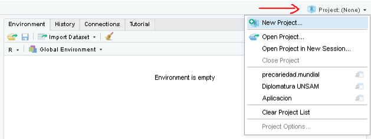
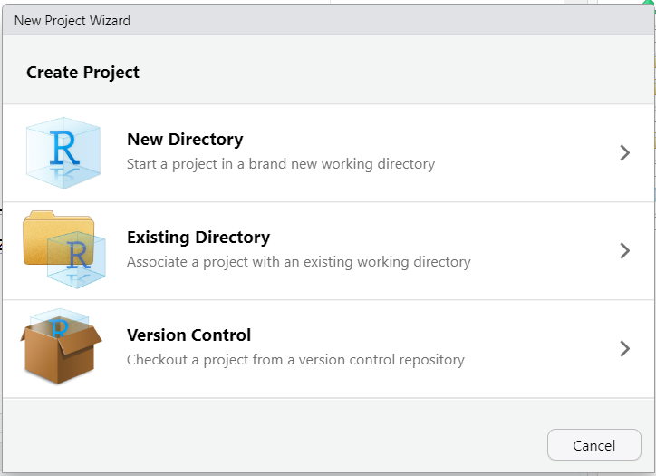
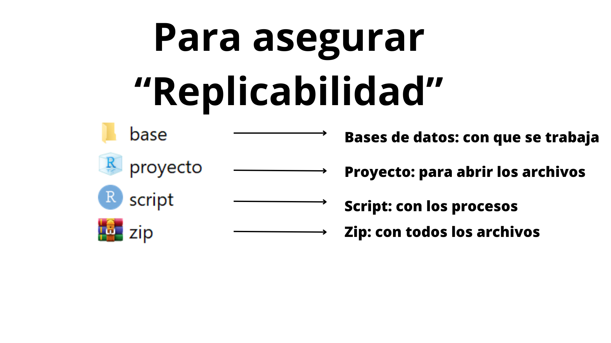
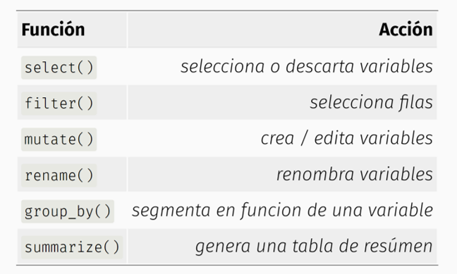

```{r xaringan-themer, include=FALSE, warning=FALSE}

pacman::p_load(xaringan,xaringanthemer,tidyverse, gt,kableExtra )

style_duo_accent(
  primary_color = "#000000",
  secondary_color = "#B40404",
  inverse_header_color = "#FFFFFF"
)

```

## En esta clase

### 0. Revisión del Entrega intermedia

### 1. Repaso

### 2. Exploración Bases de datos

### 3. Exportación de datos

### 4. Tidyverse


---
class: inverse, center, middle

# 0. Revisión entrega intermedia

---
Los dos ítems con menor desempeño del curso son Operacionalización  y Cuestionario.

Los 3 errores más comunes fueron:

  **Confusión causa-asociación** : aparece en la formulación (verbos "impacto", "efecto"), en los objetivos (verbos "comprender", "indagar"), en las hipótesis (causalidad disfrazada) y en los cuestionarios (preguntas que asumen relación causal).
    
  **Operacionalización sin definiciones teóricas**: todos los grupos entregaron la tabla concepto→dimensiones→indicadores, pero pocos definieron qué es cada cosa. Sin definición conceptual de las dimensiones, la operacionalización se vuelve una taxonomía vacía.
    
  **Cuestionarios con errores formales sistemáticos**: categorías no exhaustivas (vacíos en rangos), no mutuamente excluyentes (solapamientos), incoherencia entre enunciado dicotómico y alternativas de frecuencia, conceptos de la investigación  en boca del encuestado, falta de preguntas filtro.

---
class: inverse, center, middle

# 01. Introducción

---

## 1. Introducción — Lo que funcionó

 
- En general, todos los grupos lograron **resumir** las partes centrales del trabajo.
- La estructura introductoria está internalizada: presentar problema, sujeto, objetivos.
- Algunos grupos tienen buena claridad y escritura fluida.
 

---

## 1. Introducción — Errores transversales

 
### Falta de respaldo empírico
- Premisas planteadas sin citas, datos ni referencias.
- *"Aunque sea de público conocimiento, deben citar para dar respaldo a la premisa"*.
 

 
### Registro de escritura
- Lenguaje **coloquial** o **personal** ("nuestro", "creemos") cuando debe ser **académico e impersonal**.
- Frases enredadas, oraciones subordinadas demasiado largas.
 

 
### Decir vs. hacer
- *"Esto deben hacerlo, no escribirlo"*: explicitar la metodología en la intro en vez de simplemente desarrollarla.
 

---

## 1. Introducción — Qué reforzar

 
1. **Citar siempre** que se afirma algo sobre la realidad (datos, autores, noticias).
2. **Voz académica impersonal**: "se analiza", "la investigación se centra en".
3. **Datos duros** (cifras, porcentajes, intervalos temporales) robustecen la introducción.
4. Ojo con el vocabulario: **causalidad** (impacto, efecto, influencia) vs. **asociación** (relación, vínculo).
 

---
class: inverse, center, middle

# 02. Formulación 

---

## 2. Formulación — Errores transversales (1/2)

 
### Lógica de problematización (Lemieux)
- No se cumple la secuencia: sentido común → inferencia → ruptura → pregunta.
- Saltan directamente a la pregunta sin construir la tensión.
 

 
### Falta de dimensión temporal
- **El error más repetido**: la pregunta no especifica el *cuándo*.
- Recuerden los 5 elementos: **qué, conceptos, a quiénes, cuándo, dónde**.
 

---

## 2. Formulación — Errores transversales (2/2)

 
### Lenguaje hipotético o cualitativo
- *"Podríamos detectar..."*, *"parecía..."*: resta fuerza al planteamiento.
- verbos **analizar/conocer/establecer** son adecuados.
 

 
### Confusión causa-asociación
- *"Impacto", "efecto", "influencia"* implican causalidad.
- Sus diseños son **transversales y asociativos** → no pueden establecer causas.
 

---

## 2. Formulación — Qué reforzar

 
1. Pregunta debe contener **5 elementos definidos**: objeto, conceptos/variables, sujetos, **tiempo** y espacio.
2. Aplicar **bien la lógica de Lemieux**: presentar premisa, problematizarla con datos, llegar a la pregunta.
3. Reemplazar verbos causales por **verbos de asociación** (relacionar, asociar, vincular).
4. Pregunta clara y concisa: evitar oraciones subordinadas excesivas.
 

---
class: inverse, center, middle

# 03. Objetivos y Relevancia 

---

## 3. Objetivos — Errores transversales

 
### Verbos inapropiados
- **Comprender** → propio de la investigación cualitativa.
- **Analizar, conocer, identificar, explorar, establecer, caracterizar, medir** → cuantitativos.
 

 
### OE que exceden el OG
- Plantean objetivos específicos que **agregan variables nuevas** no contempladas en el OG.
- Los OE deben **DESAGREGAR** el OG, no excederlo.
 

 
### Mezcla de varios objetivos en uno
- Un OE no puede contener dos operaciones distintas.
- Separar: si hay dos variables o dos operaciones, son dos OE.
 
---

## 3. Objetivos — Qué reforzar

 
1. **OG = traducción de la pregunta** en forma de objetivo (más amplio).
2. **OE = desagregación del OG** (más específicos, no más amplios).
3. Verbos en infinitivo: **analizar, identificar, caracterizar, determinar, examinar**.
4. **Una variable por OE** (o una operación por OE).
5. Especificar siempre **sujeto y temporalidad** en cada objetivo.
 
---

## 3. Relevancia — Errores transversales

 
- Confunden los **3 tipos de relevancia**:
  - **Teórica**: aporte al conocimiento (no "académica").
  - **Práctica**: aporte a la intervención social.
  - **Metodológica**: aporte instrumental/técnico.
 

 
- *"Levantar datos"* no es un aporte metodológico por sí solo.
- *"Concientizar"* o *"promover"* no son relevancias, son activismo.
- El sujeto específico (estudiantes UAH) **no vuelve automáticamente relevante** la investigación.
 
---
class: inverse, center, middle

# 04. Antecedentes e Hipótesis 

---

## 4. Antecedentes — Errores transversales

 
### Listado de autores, no discusión teórica
- Resumir lo que dice cada texto **por separado** ≠ marco teórico.
- La pregunta guía debe ser: **¿qué dicen estos autores en conjunto sobre el problema?**
 

 
### Estrategias no usadas
- Recordar opciones para organizar: **por enfoques, por variables explicativas, por dimensiones, por linaje teórico**.
 

 
### Errores de citación
- No citar conceptos clave en formato **APA**.
- Citar dos veces: apellido + autor entre paréntesis.
- Omitir referencias cuando se afirma algo.
 
---
## 4. Antecedentes — Definición de conceptos

 
**Problema más serio**: no definen los conceptos centrales que se van a operacionalizar después.
 

 
- Si la investigación habla de *"autoritarismo"*, *"bienestar psicosocial"*, *"discurso político"* o *"estratificación social"* → **deben tener definición conceptual al final del marco teórico**.
- Sin definición conceptual no se puede operacionalizar.
- Recordar: paradigma → teoría general → teoría sustantiva → variables.
 
---

## 4. Hipótesis — Errores transversales

 
### Causalidad enmascarada
- Verbos como **producirá, favorecerá, generará, afectará** son causales.
- Diseño transversal y asociativo → solo permite afirmar **asociación**, no causa.
 

 
### Múltiples fenómenos en una hipótesis
- Una hipótesis con 4 elementos distintos = 4 hipótesis no formuladas.
- Separar cada relación en su propia hipótesis.
 

 
### Hipótesis no refutables
- Si basta un solo caso para confirmarla, la hipótesis no sirve.
- Debe poder **ser refutada empíricamente**.
 
---
class: inverse, center, middle

# 05. Metodología 

---

## 5. Metodología — Errores transversales

 
Item con mejor desempeño en general, pero faltan los **4 componentes** que se piden:
 

 
| Componente | Error frecuente |
|------------|-----------------|
| Estrategia | Lo confunden con "qué se va a hacer" |
| Tipo según objetivos | Lo omiten o lo confunden con temporalidad |
| Temporalidad | A veces sin especificar transversal/longitudinal |
| Grado de experimentación | **El más omitido** (no experimental) |
 
---

## 5. Metodología — Qué reforzar

 
1. **Cada uno de los 4 componentes debe estar explícito y justificado**.
2. Redacción clara: una decisión metodológica = un párrafo o sección.
3. Evitar términos que confunden:
   - *"Dependencia"* → suena causal.
   - *"Establecer relación"* ≠ *"establecer dependencia"*.
4. Coherencia interna: si su pregunta es asociativa, todo el diseño debe serlo.

---
class: inverse, center, middle

# 06. Operacionalización 

---

## 6. Operacionalización — El item más débil del curso

 
**Promedio: 23,7 / 40 (59%)** — Aquí está el foco principal.
 

 
### El error más generalizado
**No se definen los conceptos ni las dimensiones**.
 

 
- Una tabla con concepto → dimensiones → indicadores **NO es operacionalización**.
- Faltan los textos que definen **qué es cada cosa** y **por qué pertenece allí**.
 
---

## 6. Operacionalización — Errores típicos

 
### Tabla sin definiciones
- *"No están las definiciones de las dimensiones, ni de las subdimensiones"*.
 

 
### Operacionalización sin fuente
- Si tomaron un esquema de otro autor → **deben citarlo**.
- Si lo construyeron ellos → deben **justificarlo teóricamente**.
 

 
### Indicadores que no se conectan al concepto
- Indicadores sueltos que no derivan de las dimensiones.
- Indicadores repetidos en distintas dimensiones.
 
---
 
### Conceptos diferentes mezclados
- A veces se opera con la **consecuencia** del fenómeno como si fuera el fenómeno.
 
---

## 6. Operacionalización — Qué reforzar

 
**Recordar la estructura completa de Sautú**:
 

 
1. **Definición teórica** del concepto (en el marco teórico).
2. **Definición nominal** de la variable (al final del marco teórico).
3. **Desagregación** en dimensiones y subdimensiones (con definiciones).
4. **Definición operacional**: indicadores empíricos observables.
5. **Conexión lógica** entre cada nivel.
 

 
**Cada elemento de la tabla debe ir acompañado de un párrafo explicativo.**
 
---
class: inverse, center, middle

# 07. Cuestionario 

---

## 7. Cuestionario — Promedio: 22,8 / 40 (57%)

 
**El item con menor logro del curso.**
 
 
Dos grupos obtuvieron **0/5 en preguntas sociodemográficas** (no las incluyeron).
 
---

## 7. Cuestionario — Errores en categorías

 
### Categorías no exhaustivas
- Vacíos en rangos: *"si alguien se demora 40 min, ¿qué alternativa elige?"*.
- Falta opción *"Otro: ¿cuál? \_\_\_"*.
 

 
### Categorías no mutuamente excluyentes
- Solapamiento entre opciones (ej: rapidez y cercanía).
- Una persona razonablemente podría marcar dos.
 

 
### Niveles que mezclan dimensiones distintas
- Una pregunta mezcla frecuencia, cantidad y tipo en las mismas alternativas.
 
---

## 7. Cuestionario — Errores en formulación

 
### Pregunta dicotómica con escala de frecuencia (¡muy común!)
- Enunciado: *"¿Has sentido X?"* → respuesta esperada sí/no.
- Pero las alternativas son: *Nunca, A veces, Frecuentemente, Siempre*.
- **Cambiar enunciado** o **cambiar alternativas**, no mezclar lógicas.
 

 
### Varios fenómenos en una sola pregunta
- *"¿Has participado en activismo, voluntariado, marchas o trabajo comunitario?"* = 4 preguntas en una.
- Separar en ítems distintos o usar **pregunta matriz**.
 
---

## 7. Cuestionario — Errores conceptuales

 
### Sexo vs. género
- **Sexo**: hombre / mujer.
- **Género**: masculino / femenino / no binario / etc.
 

 
### Conceptos complejos sin traducción
- *"Activismo", "alienación", "vulnerabilidad", "desigualdades territoriales"*: conceptos del investigador, no del encuestado.
 

 
### Preguntas de opinión sobre otros / hipotéticas
- *"¿Crees que los estudiantes de comunas periféricas...?"* mide opinión, no experiencia.
- *"¿Preferirías estudiar en otra universidad?"* no aporta datos.
 
---

## 7. Cuestionario — Sesgos

 
### Deseabilidad social
- Preguntas con carga emotiva que orientan la respuesta.
- *"¿Considera importante...?"* → casi todos dirán sí.
 

 
### Aquiescencia
- Escalas asimétricas sin punto medio.
- Enunciados que sugieren la respuesta esperada.
 

 
### Cristalización
- Definir conceptos dentro de la pregunta orienta al encuestado.
- *"Quitar esto, induce cristalización"*.
 
---

## 7. Cuestionario — Falta de preguntas filtro

 
**Error sistemático**: preguntar por una práctica sin verificar primero si la persona la realiza.
 

 
Ejemplos:
- Preguntar por frecuencia en redes sociales **sin filtrar** si usa redes.
- Preguntar por apuestas sin filtrar si apuesta.
- Preguntar por transporte público sin filtrar si lo usa.
 

 
**Solución**: pregunta filtro dicotómica + saltos lógicos en el cuestionario.
 
---

## 7. Cuestionario — Qué reforzar (1/2)

 
1. **Categorías exhaustivas**: que cualquier respuesta posible quepa en alguna alternativa.
2. **Categorías excluyentes**: que ninguna respuesta caiga en dos alternativas.
3. **Coherencia enunciado-alternativas**: dicotómica con sí/no, frecuencia con escala de frecuencia.
4. **Una variable por pregunta**: nunca empacar varios fenómenos.
 
---

## 7. Cuestionario — Qué reforzar (2/2)

 
5. **Preguntas filtro** antes de batería de preguntas específicas.
6. **Lenguaje del encuestado**, no del investigador. Conceptos simples.
7. **Anclar en experiencia propia** del encuestado, no en opinión sobre otros.
8. **Escalas simétricas** con polos equivalentes (y considerar punto medio).
9. **Sociodemográficas obligatorias**: edad, sexo, género, comuna, etc.

--- 
class: inverse, center, middle

# Síntesis final 

---

## Los 3 lugares comunes más importantes

 
### 1. Confusión causa-asociación
Aparece en intro, formulación, objetivos e hipótesis.

**Solución**: revisar todos los verbos del proyecto. Quitar: *impacto, efecto, influencia, producir, generar, causar*.
 

 
### 2. Operacionalización sin definiciones
Tablas vacías de teoría.

**Solución**: definir cada concepto, cada dimensión y cada subdimensión por escrito antes de la tabla.
 

 
### 3. Cuestionarios con errores formales
Categorías no exhaustivas/excluyentes, incoherencias enunciado-alternativas, falta filtros.

**Solución**: revisar pregunta por pregunta usando los criterios de la clase 7-8.
 
---

## Recomendaciones para la entrega final

 
1. **Coherencia interna**: que pregunta → objetivos → hipótesis → operacionalización → cuestionario hablen de lo mismo.
2. **Citas APA correctas** en todo el documento.
3. **Definir conceptos** antes de operacionalizarlos.
4. **Cuestionario revisado** con criterios del curso (clases 7 y 8).
5. **Lenguaje académico e impersonal** en todo el texto.
 

 
### Recuerden: el cuestionario es lo que van a aplicar. Cada error allí compromete los datos que van a analizar después.
 

---
class: inverse, center, middle

# 1. Repaso

---


- Ventana (1): Editor de Sintaxis
- Ventana (2): “Entorno de Trabajo”
- Ventana (3): Sub-pestañas; Files (Historial de archivos), plots (Gráficos), packages, help - (ayuda)
- Ventana (4): Visualizador de resultados.

---

## Lógica y estructura de un comando


---

## Tipos de objetos -> Vector
* Almacenamiento contiguo (filas o columnas), tienen una dimensión
* Puede almacenar información numérica, caracteres, valores lógicos (TRUE or FALSE)
Ejemplo:
```{r}
vector_numerico <- c(1, 2, 4, 78, 42, 3, 65)
vector_de_texto <- c("casa", "auto", "bus", "bicicleta")

```
---
## Tipos de objetos -> Factor
* Se trata de un vector que puede almacenar dos capas de información (tiene dos dimensiones): números y letras. 
* Es útil para variables nominales (como género) u ordinales (muy satisfecho, satisfecho, poco satisfecho, muy insatisfecho)


```{r}

genero <- c(1,2,2,2,1,2,1,99,99)
generof <- factor (genero, labels = c("Hombre", "Mujer", NA))

#otra forma
letras <- c("Hombre", "Mujer", NA)
generof2 <- factor (genero, labels = letras)
table(generof2)

```

---

## Tipos de objetos Bases de datos (Data Frame)

* El elemento data.frame es lo que conocemos como una base de datos: Filas (casos) y columnas (variables) relacionadas entre sí:


---


## Rproject 

Crear un proyecto de R utilizando RStudio y el archivo .Rproj permite:

* Organización de archivos y directorios (Fácil acceso)
* Aislamiento del entorno de trabajo.
* Esto hace que sea más fácil compartir archivos, porque se comparte el proyecto (fácil replicabilidad)


<div style="text-align:center">
    
</div>

---
## Rproject !

* Para crearlo, vamos al logo de *"nuevo proyecto"* y elegimos la carpeta de trabajo. Cuando trabajemos con proyectos
    - El directorio de trabajo siempre toma como punto inicial la carpeta donde esta ubicada el archivo .Rproj.
    - El *Environment* es específico de nuestro proyecto. No se nos mezclará con resultados de código que podamos correr en otros proyectos.



---
.pull-left[
]

.pull-right[
Siempre al enviar un trabajo, deberá incluir: 
* base de datos 
* proyecto
* script 
* puede hacerlo comprimido en zip]

---



---


# Importación de bases de datos

A la hora de importar una base de datos nos podemos llegar a enfrentar a distintos tipos de archivos. En R contamos con **distintos paquetes y funciones** según el **tipo de extensión** del archivo:

```{r echo=FALSE}

importacion <- tibble(
  "Tipo de archivo" = c("Texto Plano",
                        "Texto Plano",
                        "Texto Plano",
                        "Extension de R",
                        "Extension de R",
                         "Otros Softwares",
                         "Otros Softwares",
                         "Excel",
                         "Excel"),
           "Paquete" =c("readr",
                        "readr",
                        "readr",
                        "RBase",
                        "RBase",
                        "haven",
                        "haven",
                        "openxlsx",
                        "readxl"),
             "Extension" =c(".csv",
                          ".txt",
                          ".tsv",
                          ".RDS",
                          ".RDATA",
                          ".dta",
                          ".sav",
                          ".xlsx",
                          ".xls"),
         "Funciones" = c("read_csv()",
                           "read_txt()","read_tsv()",
                           "readRDS()", "open()",
                           "read_dta()","read_spss()",
                           "read.xlsx()","read_excel()")    
)  

kable(importacion, format = 'html') %>%
  kable_styling(bootstrap_options = c("striped", "hover")) %>% 
  collapse_rows(columns = 2)
```

---
# Importación de bases de datos

El primer y más importante parámetro de las funciones para importar datos suele llamarse  **`file`**. Allí debemos especificar la ruta hasta el archivo, incluyendo la extensión del mismo. 

Si tenemos abierto un proyecto, el punto de partida para la ruta a especificar será la carpeta del proyecto. Si queremos ir hacia atrás en las carpetas agregamos  **`../`**
```{r eval=FALSE, include=T}
base.vacunas<- read_csv(
  file = "../Fuentes/Covid19VacunasAgrupadas.csv",
  col_names = TRUE, # TRUE si la primera fila tiene nombres de columnas
  n_max = 100)      # Puedo especificar cuantas filas levantar

base.covid <- readRDS(file = "../Fuentes/base_covid_sample.RDS")
```
**IMPORTANTE**: Siempre que lean bases de datos asignarlas a un **nuevo objeto**. De lo contrario, las va a mostrar completas en consola y no las guardará en el enviroment.

---

# Repaso de importación

### 1. Abrir archivo RDS 
base.covid <- readRDS (file = ".../donde_está_según_mi_proyecto")
```{r}
#ejemplo
tweets_vacunas <- readRDS (file = "Fuentes/Bases adicionales/vacuna.tweets.RDS")


#no requiere instalar un paquete

```
---
# Repaso de importación

### 2. Abrir archivo CSV 
### read.csv()
Está en tidyverse

- library (tidyverse) 
- read.csv()

```{r , warning=FALSE}
c19 <- read_csv(file ="Fuentes/Bases adicionales/Covid19VacunasAgrupadas.csv")
```

---

### Forma de operar:
 a) estoy situado en mi proyecto,
 b) apreto comillas""
 c) para buscar el archivo que quiero, puedo retroceder (../) hacia carpetas anteriores o buscar
 d) realizar la búsqueda con tecla tab, evita equivocaciones en la escritura. 
```{r}
remove(list = ls()) #para que sirve?
```

---
# Repaso de importación

### 3. Abrir archivo xlsx
### read.xlsx(): xlsx 

Abrir archivo, en pestaña 1 y que empiece en fila 4 (hay información no relevante antes)

la función startRow = ; indica desde que fila empezar
```{r}
library(openxlsx)
base.adquisiciones1 <- read.xlsx(xlsxFile = "Fuentes/Bases adicionales/Adquisiciones y vuelos covid.xlsx", 
                                 sheet = 1, startRow = 4) 

```


---

class: inverse, center, middle

# 2. Exploración Bases de datos

---

# Explorar DataFrame

Una las funciones con la explicación que corresponda

Función              | Explicación
---------------------|-------------------------------------
dim(base)            |frecuencias de variable en particular
summary(base)        |nombre de columnas
names(base)          |conjunto resumen de estadísticos
unique(base$variable)|categorías de variable en particular
table(base$variable) |cantidad de filas y columnas

---
# Explorar DataFrame


Función              | Explicación
---------------------|-------------------------------------
dim(base)            | cantidad de filas y columnas
summary(base)        | conjunto resumen de estadísticos
names(base)          | nombre de columnas
unique(base$variable)| categorías de variable en particular
table(base$variable) | frecuencias de variable en particular
glimpse(base)        | primeros valores las variables y su clase

---
# Explorar DataFrame


glimpse
```{r}

glimpse(base.adquisiciones1)
```

---


names y unique


```{r}
names(base.adquisiciones1)
unique(base.adquisiciones1$ESTADO.DE.PROCESO)
```

---
# Explorar DataFrame

Frecuencias, ejemplo: Table

```{r}
base_práctica <- readRDS("Fuentes/base_covid_sample.RDS")

#En valor absoluto
table(base_práctica$sexo)

#En porcentaje
prop.table(table(base_práctica$sexo))*100
```

---
# Explorar DataFrame

### Elaboración de un tabulado bivariado entre las variables sexo y clasificacion_resumen
#### Estructura: table(base$variable1, base$variable2)

```{r}

#Tabla cruzada
table(base_práctica$sexo, 
      base_práctica$clasificacion_resumen)
```


---

class: inverse, center, middle

# 3. Exportación de datos

---

# Exportación de datos

Por lo general, cada paquete que presenta funciones para importar bases de dato, tiene como complemento una función para exportar (guardar en el disco de nuestra PC) un objeto con la misma extensión. Ejemplos:

- el paquete openxlsx tiene una función denominada write.xlsx() que nos permite exportar un dataframe creando un archivo .xslx
- en RBase la función saveRDS() nos permite exportar archivos de extensión .RDS (son menos pesados para trabajarlos luego desde R)
- en general estas funciones tienen un primer parámetro para especificar el objeto a exportar, y un segundo para especificar la ruta y el nombre de archivo a crear ()

write.xlsx(x = objeto_resultados, file = "Resultados/cuadro1.xlsx")
saveRDS(object = objeto_resultados, file = "Resultados/base_nueva.RDS")

---
# Exportación de datos

### write_ ()
Cada paquete que presenta funciones para importar bases de datos, tiene como 
complemento una función para exportar (guardar en el disco de nuestra PC) un 
objeto con la misma extensión.

```{r, eval=FALSE}
#levanto bases distitos tipos de archivos

base_prueba <- read.csv("Fuentes/Bases adicionales/Covid19VacunasAgrupadas.csv")

base_prueba2 <- read.xlsx("Fuentes/Bases adicionales/Adquisiciones y vuelos covid.xlsx", 
                          startRow = 4)
#realizo otra base
base_prueba3 <- data.frame (x = c(1,2,3),
                            y = c("uno","dos","tres"))
#estructura write.csv:
write.csv(x= objeto_base_de_datos_en_ambiente, file = "arhivo_de_exportacion.csv")

```

---
# Exportación de datos

```{r}
#Creo una base de datos y la guardo en el ambiente 
base_prueba3 <- data.frame (x = c(1,2,3),
                            y = c("uno","dos","tres"))

#write.csv (default separa por ",")####
write.csv(x= base_prueba3, file = "arhivo_de_exportacion0.csv")
#observo como queda

#write.csv2 (default separa por ";")####
write.csv2(x= base_prueba3, file = "arhivo_de_exportacion1.csv")
#observo como queda

base_prueba3
```
---
# Exportación de datos

## write.xlsx()
```{r, eval=FALSE}

#write.xlsx() ####
#estructura
write.xlsx(x = objeto_resultados,file = "Resultados/cuadro1.xlsx")
```


## saveRDS()
```{r, eval=FALSE}

#saveRDS()
saveRDS(object = objeto_resultados,file = "Resultados/base_nueva.RDS")

saveRDS(object = base.adquisiciones1,file = "cuadro1.RDS")

```


---
class: inverse, center, middle

# 4. Tidyverse

---
# Tidyverse

Tidyverse es un paquete que incluye la instalación varios paquetes útiles para la manipulación y análisis de datos, tales como dplyr , tidyr , ggplot2 , etc

```{r, eval=FALSE}
#Sólo una vez (por computadora):
install.packages("tidyverse")

# En cada inicio de sesión de R o Rstudio:
library(tidyverse)

#No es necesario esto:
install.packages("dplyr")
install.packages("tidyr")
install.packages("ggplot2")

```
---
# Tidyverse
## magrittr 
### pipe %>%


```{r}

base_covid <- readRDS("Fuentes/base_covid_sample.RDS")
base_covid$sexo %>% table()

```

---
# Tidyverse
## pipe %>% 
- ir encadenando funciones

trabajo sobre variable de base
*%>%* 
quiero una tabla
*%>%* 
a esa tabla quiero hacerle una distribución relativa
*%>%* 
y finalmente redondar (con cierta cantidad de dígitos)

```{r}
base_covid$sexo %>% 
  table () %>% 
  prop.table () %>% 
  round(digits = 2)
```

---
# Tidyverse
## dplyr



---
# Tidyverse
## Select()

Supongamos que debo realizar un pequeño informe para caracterizar los CASOS COVID-19 registrados en el país, según la edad y sexo.
Para ello, en base a la metadata, identifico los nombres de las variables en cuestión:*sexo*/*edad*

Luego, procedemos a cargar las librerías que voy a utilizar:

```{r, eval=FALSE}
library(tidyverse)
```

Finalmente, creamos un objeto en donde importo la base de datos con la función readRDS():

```{r}

base_covid <- readRDS("Fuentes/base_covid_sample.RDS")
```

---
# Tidyverse
## Select() - nombre de las variables

selecciono las columnas que deseo de la base de datos:

```{r, eval=FALSE}
base_covid_seleccion <- base_covid %>% 
select(sexo, edad)
```

Chequeo la operación:
```{r, eval=FALSE}
colnames(base_covid_seleccion)
```
[1] "sexo" "edad"

---
# Tidyverse
## Select() - nombre de las variables

selecciono las columnas que deseo de la base de datos:
```{r, eval=FALSE}
# a) seleccionar por nombre de variable/columna

base_de_datos %>% 
  select(id, nombre)
```

---
# Tidyverse
## Select() - por posición de la columna

Aplico la función select() en base a la posición de las columnas:
```{r, eval=FALSE}

base_covid_seleccion <- base_covid %>% 
select(1, 3, 4)
```

chequeo seleccion:
```{r, eval=FALSE}
colnames(base_covid_seleccion)
```
[1] "id_evento_caso" "edad" "edad_años_meses"
---
# Tidyverse
## Select() - por posición de la columna

```{r}
base_covid_seleccion <- base_covid %>% 
  select(1, 2, 3)

#reviso
names(base_covid_seleccion)
```

---
# Tidyverse
## filter()

Caso: Quiero quedarme únicamente con aquella población que tuvieron 'asistencia respiratoria mecánica'.
Según la metadata, la variable que necesito para filtrar se llama *asistencia_respiratoria_mecanica*, cuyas categorías son **SI/NO**:

```{r}

base_covid %>%
  select(id_evento_caso,asistencia_respiratoria_mecanica) %>%
  filter(asistencia_respiratoria_mecanica == "SI")# * Doble signo igual junto ==

```

```{r}
#ejemplo: mayores de 70
base_covid_practica_seleccion <-base_covid %>% 
  filter(edad > 70)
```

---
# Tidyverse
## filter()

```{r}
#observo la base
table(base_covid_practica_seleccion$edad)

#ejemplo 2: quiero seleccionar los que tengan 37
base_covid_practica_seleccion <-base_covid %>% 
  filter(edad == 37)

base_covid_practica_seleccion
```
---

# Operadores lógicos


| Operador | Descripción             | Ejemplo                              |
|----------|-------------------------|--------------------------------------|
| ==       | Igual a                 | `edad == 5`                          |
| !=       | No es igual a           | `sexo != "F"`                        |
| <        | Menor que               | `edad < 18`                          |
| >        | Mayor que               | `edad > 18`                          |
| <=       | Menor o igual que       | `edad <= 18`                         |
| >=       | Mayor o igual que       | `edad >= 65`                         |
| &        | Y lógico (AND)          | `sexo != "M" & edad <= 18`            |


```{r}
base_covid_practica_seleccion <-base_covid %>% 
  filter(edad > 70)
base_covid_practica_seleccion <-base_covid %>% 
  filter(edad == 37)
```

---

# Operadores lógicos: & | %in%

- &:  AND: Cuando se cumplen ambas condiciones
- |:  OR: Cuando se cumple una u otra condición
- %in%: Incluye. Lo que está a la izquierda está incluido en lo q está a la derecha


```{r}
#forma 0
base_covid_practica_seleccion <-base_covid %>% 
  select(sexo, edad, residencia_provincia_nombre) %>% 
  filter(sexo != "M" & residencia_provincia_nombre == "CABA")

#forma 1
base_covid_practica_seleccion <-base_covid %>%
  select(sexo, edad, residencia_provincia_nombre, asistencia_respiratoria_mecanica) %>% 
  filter(residencia_provincia_nombre == "CABA" |
           residencia_provincia_nombre == "Buenos Aires")

#forma 2
base_covid_practica_seleccion <-base_covid %>%
  select(sexo, edad, residencia_provincia_nombre, asistencia_respiratoria_mecanica) %>% 
  filter(residencia_provincia_nombre  %in% c("CABA", "Buenos Aires"))


```
---


