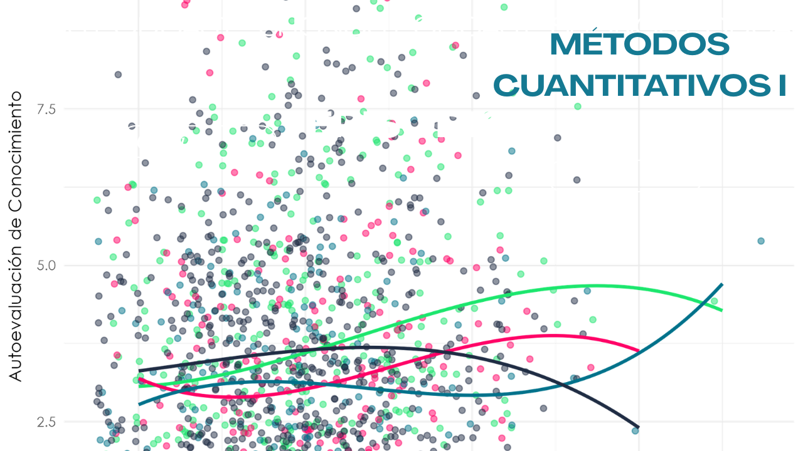
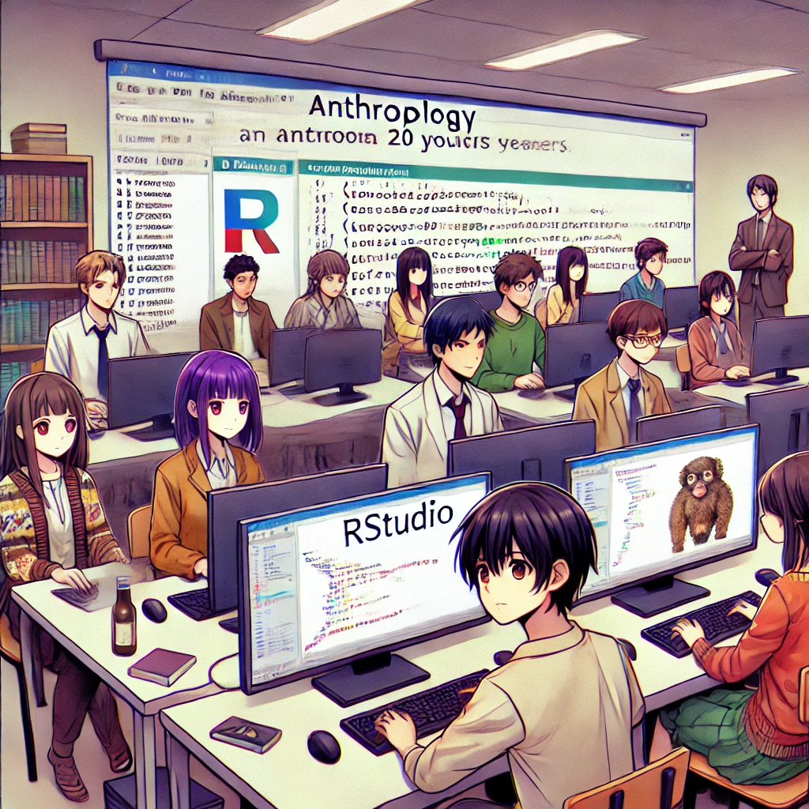

### Bienvenidxs al curso de Métodos Cuantitativos I de la carrera de Antropología en la Universidad Alberto Hurtado.

### Equipo Académico

| Profesor           | email                       | 
|--------------------|-----------------------------|
| Gino Ocampo    | ginowrs@gmail.com  |

| Ayudante           | email                       |
|--------------------|-----------------------------|
| Fracesca Roco    | Fran.roco21@gmail.com |

A continuación, podrán descargar el programa y programación del curso.

Programa: [`[Programa]`](https://gino-ocampo.github.io/mc1/files/metodos_cuantitativos_i.pdf) 

Programación: [`[Programación]`](https://docs.google.com/spreadsheets/d/15eNM57Jhn7VSAj884CMuQaW8sEU5udugAYhq2AWubY4/edit?usp=sharing )

---
## Descarga e instalación de R y RStudio

- Descargar e instalar `R`: [`[Cápsula]`](https://youtu.be/URtP9Qo2Trw?si=6BCceJEx7f6sXduZ) 
- Descargar e instalar `RTools`: [`[Cápsula]`](https://www.youtube.com/watch?v=Re3DqxM_f2k)

---
## Calendario Clases

Nota: Todas las clases son presenciales, a continuación pueden ver las presentaciones de las clases.

| n° Clase| Fecha              | Contenido                                                                                                           | Material                                                                                                                                                                |
|------|--------------------|---------------------------------------------------------------------------------------------------------------------|-------------------------------------------------------------------------------------------------------------------------------------------------------------------------|
| 1    | 17-03-2026          | Presentación curso, acuerdos e introducción a ISCUAN                                                                | [`Clase1`](https://gino-ocampo.github.io/mc1/clases/clase_01/clase_01.html) · [`Podcast`](https://open.spotify.com/episode/1wfPRgAwDE8cuL6QEbFpoD?si=acab1ae7d486474a)                          |
| 2    | 24-03-2026          | Diseño cuantitativo e Ideas de investigación                                                                        | [`Clase2`](https://gino-ocampo.github.io/mc1/clases/clase_02/clase_02.html) · [`Podcast`](https://open.spotify.com/episode/14Fv1pq5NHGezr7f5JtnXN?si=d9dd1d6e9bc9401d)                         |
| 3    | ONLINE - Vía Cápsula| R: Introducción y RStudio                                                                                           | [`Clase3`](https://gino-ocampo.github.io/mc1/clases/clase_03/clase_3.html) · [`.R`](https://gino-ocampo.github.io/mc1/clases/clase_03/clase_3.R) · [`Ver`](https://www.youtube.com/playlist?list=PLt-P_DkeQXb9v5mrDk8U9C3IEPoA-XbZ7) · [`Podcast`](https://open.spotify.com/episode/1YISa3Lbc1F7UxUItiLGAr?si=e829fcda981b4920) |
| 4    | 31-03-2026          | Problematización y búsqueda bibliográfica                                                                           | [`Clase4`](https://gino-ocampo.github.io/mc1/clases/clase_04/clase_04.html) · [`Podcast`](https://open.spotify.com/episode/66CaugyJfKRXr3IXLE6aPF?si=a93bdb197ed24e7e)                        |
| 5    | 07-04-2026          | R: proyectos, paquetes, funciones, bases de datos                                                                   | [`Clase5`](https://gino-ocampo.github.io/mc1/clases/clase_05/clase_05.html) · [`.R`](https://gino-ocampo.github.io/mc1/clases/clase_05/clase_05.R) · [`Fuentes`](https://gino-ocampo.github.io/mc1/clases/clase_05/Fuentes/Fuentes.rar) · [`Rúbrica y Preguntas Prueba`](https://gino-ocampo.github.io/mc1/clases/clase_05/PreguntasOrientadoras.pdf) · [`Podcast`](https://open.spotify.com/episode/0tODNy7kRhHC2MzgMNZnV7?si=4c00e4c7c8e548d0)                       |
| 6    | 14-04-2026         |Prueba 1: (a) Introducción a la investigación cuantitativa, el diseño, el lugar de la teoría; (b) Introducción a R, tipos de objetos, proyectos, paquetes, funciones, manejo de base de datos| [`Clase7`](#https://gino-ocampo.github.io/mc1/clases/clase_07/clase_07.pptx#) · [`Podcast`](https://open.spotify.com/episode/1rFGbDsAtSHwNZPCoVAfKf)                                             |
| 7    | 21-04-2026         | Operacionalización, tipos de estudios| [`Clase8`](#https://gino-ocampo.github.io/mc1/clases/clase_08/clase_08.pptx#) · [`¿De quién es?`](https://gino-ocampo.github.io/mc1/clases/clase_08/dequienes.pdf) · [`Podcast`](https://open.spotify.com/episode/4d4OZbmDFcafup6dRH3rfc?si=bb8773030ee04ef0) |
| 8    | 28-10-2026         | Índices y escalas    | Pendiente                                                                                                                                                              |
| 9    | 05-05-2026         | Técnicas de producción de datos: Encuestas| [`Clase9`](#https://gino-ocampo.github.io/mc1/clases/clase_09/clase_09.pptx#) · [`Podcast`](https://open.spotify.com/episode/54nJgA0yq66eecLoVfalVo?si=a102b99743fa4f17)                        |
| 10   | 12-05-2026         | R: Exploración, guardar base y `tidyverse`                                                                          | [`Clase10`](#https://gino-ocampo.github.io/mc1/clases/clase_10/clase_10#1) · [`.R`](https://gino-ocampo.github.io/mc1/clases/clase_10/clase_10.R) · [`Fuente1`](https://gino-ocampo.github.io/mc1/clases/clase_10/fuentes/generales/Adquisiciones_y_vuelos_covid.xlsx) · [`Fuente2`](https://gino-ocampo.github.io/mc1/clases/clase_10/fuentes/generales/base_covid_sample.RDS) · [`Fuente3`](https://gino-ocampo.github.io/mc1/clases/clase_10/fuentes/generales/Covid19VacunasAgrupadas.csv) · [`Fuente4`](https://gino-ocampo.github.io/mc1/clases/clase_10/fuentes/generales/vacuna.tweets.RDS) · [`Fuente5`](https://gino-ocampo.github.io/mc1/clases/clase_10/fuentes/generales/Encuesta_Estudiantes_Antropología_2023_(respuestas).xlsx)|
| 11   | 19-05-2026         | **Entrega Intermedia**: Marco Teórico y Metodológico, operacionalización                                             | Pendiente                                                                                                                                                              |
| 12   | 26-05-2026         | Repaso general Prueba II                                                                               | [`Clase11`](#https://gino-ocampo.github.io/mc1/clases/clase_11/clase_11#1) · [`.R`](https://gino-ocampo.github.io/mc1/clases/clase_11/clase_11.R) · [`Fuente1`](https://gino-ocampo.github.io/mc1/clases/clase_11/base/encuestaestudiantes2023.xlsx)                               |
| 13   | 02-06-2026         | Pureba 2: (a) Operacionalización, encuesta, cuestionario; (b) `tidyverse`                                                                                                  |    [`.R`](#https://gino-ocampo.github.io/mc1/clases/clase_12/ensayo/apellido_nombre_prueba2.R) · [`Fuente1`](#https://gino-ocampo.github.io/mc1/clases/clase_12/ensayo/encuesta_estudiantes_2023.xlsx)                                                                                                                                                                  |
| 14   | 09-06-2026         | Análisis de datos en la Investigación Cuantitativa y Construcción de Reporte             | [`Script de Repaso`](#https://gino-ocampo.github.io/mc1/clases/clase_13/script_repaso.R)                                                                                       |
| 15   | 16-06-2026         | TutoríasObligatoria: Dudas para el trabajo Final                                                                                               | [`Instrucciones`](#https://gino-ocampo.github.io/mc1/clases/clase_14/01_Instrucciones.docx) · [`Rúbrica`](#https://gino-ocampo.github.io/mc1/clases/clase_14/02_Rubrica.docx)    |
| 16   | 23-06-2026         | **Entrega Grupal Final**: presentación de investigación en clases y entrega de trabajo                              | [`Podcast`](https://open.spotify.com/episode/6g3oG5X2siF6USSzb2L6j7?si=c7603b0308034847)                                                                                    |

---
## Bibliografía por clase

Deberá leer la bibliografía correspondiente para cada clase, la cual está [`[Aquí]`](https://docs.google.com/spreadsheets/d/1zBUMH98qO25tHSWfKVzr9Hxc3JOhj_hXAKpcQEm27Jw/edit?gid=0#gid=0) 

---

## Calendario Ayudantías
Nota: En general las ayundantías son online, a excepción de que se coordine con Francesca

| n°   | Fecha       | Contenido                                                                      | Material   | Grabación | 
|------|-------------|-------------------------------------------------------------------------------|------------| |
| 1  | 26-03-2026  | Metodología cuantitativa y proceso de investigación | [`PPT`](ayudantias/ayudantia_1/ayudantia1.pdf) | [`[Ayudantía 1]`](https://teams.cloud.microsoft/l/meetingrecap?driveId=b%21hu1prPdF4UePuXx2lGh-t8dwlOS9E4dAgip2ehD8kTEXWz8rI10_QLXDhAE0Xqq3&driveItemId=01SRKMGE3IEOUTBRLUPJB2V56I4EFUKJUY&sitePath=https%3A%2F%2Fuahurtadocl.sharepoint.com%2Fsites%2FAyudantas_f96904%2FDocumentos+compartidos%2FGeneral%2FRecordings%2FReuni%C3%B3n+en+General-20260326_195149-Grabaci%C3%B3n+de+la+reuni%C3%B3n.mp4%3Fweb%3D1&fileUrl=https%3A%2F%2Fuahurtadocl.sharepoint.com%2Fsites%2FAyudantas_f96904%2FDocumentos+compartidos%2FGeneral%2FRecordings%2FReuni%C3%B3n+en+General-20260326_195149-Grabaci%C3%B3n+de+la+reuni%C3%B3n.mp4%3Fweb%3D1&threadId=19%3AiHGuqU3OrFOlKpeVSLg4owuB0NNR1pA4FH4taootkTs1%40thread.tacv2&organizerId=0ed3982e-93d6-4599-9a31-d179e69c9297&tenantId=e049a386-0d1c-4632-b31d-c627c8cd07e9&callId=6e95a1d0-97d0-4a57-a910-61181c8c9a81&threadType=space&meetingType=MeetNow&organizerGroupId=d9d96d71-eca9-4310-94d3-4a4e5f629954&channelType=Standard&replyChainId=1774563949349&subType=RecapSharingLink_RecapCore) |
| 2  | 02-04-2026  | Introducción a RStudio y BBDD | Pendiente  | Pendiente |
| 3  | 09-04-2026  | RStudio: proyectos, paquetes, funciones, objetos y Repaso general investigación | Pendiente  | Pendiente |
| 4  | 07-05-2026  | Marco teórico y metodológico, Operacionalización, Índices y escalas, Encuestas | Pendiente  | Pendiente |
| 5 | 14-05-2026  | RStudio: Tidyverse y ggplot | Pendiente  | Pendiente |
| 6 | 28-11-2026  | Repaso contenidos prueba II y resolución dudas | Pendiente  | Pendiente |
| 7 | 18-11-2026  | Repaso análisis de datos y abordaje instrucciones entrega final | Pendiente | Pendiente |

---

### Horarios ayudantías

- Aquí puedes votar por el horario de ayudantía que más te acomode [`[Forms]`](https://docs.google.com/forms/d/e/1FAIpQLSfpoReQE0C0GOog4_ClBoYK7rpViSOoIaWDLetdwuRccnIx1A/viewform?usp=sharing&ouid=107472191361985780533)

---

### Sugerencias y Comentarios Clases, Ayudantías y Evaluaciones

- Aquí, en el siguiente [`[Forms]`](https://forms.gle/VCG7cmr5cr7tryAC7) pueden dejar sus críticas, comentarios o sugerencias. En lo posible que sean  constructivas para que podamos ir mejorando. 
- Los comentarios son anónimos !

 

---
##  Tareas

| n° | Fecha       | Contenido                                                                                                                                  | Link                                                                                                                                      |
|----|-------------|-------------------------------------------------------------------------------------------------------------------------------------------|-------------------------------------------------------------------------------------------------------------------------------------------|
| 1  | 19-03-2026  | Tarea 1: Defina su grupo y traiga dos temas de investigación por grupo                                                                     | [Llenar](https://docs.google.com/document/d/1rnPj4Ws0fRB7pyEr_-ZLg1mCBndi91PmgaAHhzh4Feg/edit?usp=sharing)                       |
| 2  | 02-04-2026  | Tarea 2:Seleccionar idea final, problematizar y generar: pregunta, objetivos, hipótesis y relevancia +  Tener instalado R y desarrollar tarea | [Llenar](#https://docs.google.com/document/d/1pzb7SxNylHTOBGxFlS3UGeIbg9CiSH5hJAcYj3L-r4s/edit)                                  |
| 3  | 02-04-2026  | Tarea 3: Hacer 2 fichas bibliográficas por persona                                                                                             |  enviar a: ginowrs@gmail.com|
| 4  | 23-04-2026  | Tarea 4: Especificar Marco Teórico y Marco Metodológico: estrategia metodológica, objetivos, supuestos de experimentación                  | [Llenar](#https://docs.google.com/document/d/1pzb7SxNylHTOBGxFlS3UGeIbg9CiSH5hJAcYj3L-r4s/edit)                                  |
| 5  | 30-04-2026  | Tarea 5: Traer preguntas de cuestionario y digitalizarlas en Google Forms                                                                  |         enviar a ginowrs@gmail.com                         |

---
## Asistencia

Para ver su asistencia dirijasé al siguiente [`[link]`](https://docs.google.com/spreadsheets/d/1qsxzNVkld9Ovc4ruK24kT-pd_PA5DOyzVn93HTPKOXM/edit?usp=sharing)

Recuerde puede faltar a 8 bloques! y debe ir a al menos a 3 Ayudantías!

---
## Grupos de trabajo

| Grupo | Tema                                | Nombre                                  |
|-------|-------------------------------------|-----------------------------------------|
| 1     |                                     |                                         |
|       |                                     |                                         |
|       |                                     |                                         |
|       |                                     |                                         |
|       |                                     |                                         |
|       |                                     |                                         |
| 2     |                                     |                                         |
|       |                                     |                                         |
|       |                                     |                                         |
|       |                                     |                                         |
|       |                                     |                                         |
|       |                                     |                                         |
| 3     |                                     |                                         |
|       |                                     |                                         |
|       |                                     |                                         |
|       |                                     |                                         |
|       |                                     |                                         |
|       |                                     |                                         |
| 4     |                                     |                                         |
|       |                                     |                                         |
|       |                                     |                                         |
|       |                                     |                                         |
|       |                                     |                                         |
|       |                                     |                                         |
| 5     |                                     |                                         |
|       |                                     |                                         |
|       |                                     |                                         |
|       |                                     |                                         |
|       |                                     |                                         |
|       |                                     |                                         |
| 6     |                                     |                                         |
|       |                                     |                                         |
|       |                                     |                                         |
|       |                                     |                                         |
|       |                                     |                                         |
|       |                                     |                                         |

---

## Ejemplos de trabajos

| Tipo  | Tema                               | Material | 
|-------|------------------------------------|----------|
| Ficha | Ejemplo 1                          |   [`1`](https://gino-ocampo.github.io/mc1/files/Trabajos/ejficha1.docx)| 
| Ficha | Ejemplo 2                          | [`2`](https://gino-ocampo.github.io/mc1//files/Trabajos/ejficha2.docx) | 
| Ficha | Ejemplo 3                          | [`3`](https://gino-ocampo.github.io/mc1//files/Trabajos/ejficha3.docx) | 
| Trabajo curso 1 | Salud                         | [`4`](https://gino-ocampo.github.io/mc1//files/Trabajos/ejtfinal.docx) | 
| Trabajo final del curso | Directores proyecto     | [`[link]`](https://uahurtadocl.sharepoint.com/sites/Section_22411893031/_layouts/15/stream.aspx?id=%2Fsites%2FSection%5F22411893031%2FStudent%20Work%2FSubmitted%20files%2FJOAQU%C3%8DN%20IGNACIO%20ORELLANA%20MILLAR%2FTrabajo%20Final%2FVE%20Project%201%2Emp4&referrer=StreamWebApp%2EWeb&referrerScenario=AddressBarCopied%2Eview%2E9d47eaac%2D5071%2D4861%2Db3b2%2D3c27ed7fb987) | 

---
#### Bibliografía del curso

- **R for Data Science** (Hadley Wickham & Garrett Grolemund) [`[e-Book]`](https://r4ds.had.co.nz/)

**Básica**

- [`[Canales (2006) Metodologías de investigación social - Leer textos de Asun! ]`](https://gino-ocampo.github.io/mc1/bibliografía/basica/2006Canales.pdf)
- [`[Boccardo y Ruiz (2019) RStudio para Estadística Descriptiva en Ciencias Sociales]`](https://gino-ocampo.github.io/mc1/bibliografía/basica/2019BoccardoRuiz.pdf)
- [`[Lemieux (2010)]`](https://gino-ocampo.github.io/mc1/bibliografía/basica/2010Lemieux.pdf)
- [`[Hernandez, Sampieri y Torres (2018)]`](https://gino-ocampo.github.io/mc1/bibliografía/basica/2018HernandezSampieriTorres.pdf)
- [`[Marradi, Archenti, Piovani (2007)]`](https://gino-ocampo.github.io/mc1/bibliografía/basica/2007MarradiArchentiPiovani.pdf)
- [`[Sautu, Bonolio, Dalle (2005)]`](https://gino-ocampo.github.io/mc1/bibliografía/basica/2005SautuBonoloiDalle.pdf)

**Complementaria**

- [`[Imai, K. (2018). Quantitative social science: an introduction. Princeton University Press]`](https://metodoscuantitativos.github.io/mc2/bibliografía/complementaria/Imai-(2008)-Quantitative-Social-Science-An-ntroduction.pdf)

- [`[Madrigal L. Frontmatter. In: Statistics for Anthropology. Cambridge University Press; 2012:i-v]`](https://metodoscuantitativos.github.io/mc2/bibliografía/complementaria/Lorena-Madrigal-Statistics-for-Anthropology-Cambridge-University-Press-(2012).pdf) 

- [`[Harvey, G. (2016). Excel 2016 for dummies. John Wiley & Sons]`](https://metodoscuantitativos.github.io/mc2/bibliografía/complementaria/Para-Dummies-Greg-Harvey-Excel-2016-para-Dummies-Para-Dummies-2017.pdf)

**Optativa**

- [`[Howard s. Becker - Datos, pruebas e ideas-Siglo XXI (2018)]`](https://metodoscuantitativos.github.io/mc2/bibliografía/optativa/Howard-Becker-Datos-pruebas-e-ideas-Siglo-XXI-(2018).pdf)

- [`[Joel (2004) Uso y Abuson de Las Estadisticas]`](https://metodoscuantitativos.github.io/mc2/bibliografía/optativa/Joel(2004)-Uso-y-Abuson-de-Las-Estadisticas.pdf)

- [`[D'Ignazio y Klein (2020) Data Feminism-MIT Press]`](https://metodoscuantitativos.github.io/mc2/bibliografía/optativa/D'Ignazio-y-Klein-(2020)-Data-Feminism-MIT-Press.pdf)
 
- [`[Sevilla (2005) Gramática de los gráficos]`](https://metodoscuantitativos.github.io/mc2/bibliografía/optativa/Sevilla-(2005)-Gramática-de-los-gráficos.pdf)

- [`[Sosa, Walter (2020) Big Data]`](https://metodoscuantitativos.github.io/mc2/bibliografía/optativa/Sosa-Walter-(2020)-Big-Data.pdf)

- [`[AS Checklist for Articles_OSF]`](https://metodoscuantitativos.github.io/mc2/bibliografía/optativa/AS-Checklist-for-Articles-OSF.pdf)

- [`[Belcher Cómo-escribir-un-artículo-académico-en-12-semanas]`](https://metodoscuantitativos.github.io/mc2/bibliografía/optativa/Belcher-Cómo-escribir-un-artículo-académico-en-12-semanas.pdf)

 
---

[`C`](https://gino-ocampo.github.io/mc1/clases/clase_13/pruebas/c/apellido_nombre_prueba2_C_No_Resuelta.R) · [`FC`](https://gino-ocampo.github.io/mc1/clases/clase_13/pruebas/c/es_2023.xlsx)   
